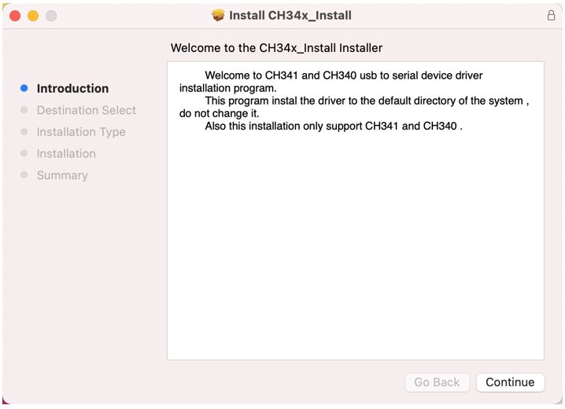
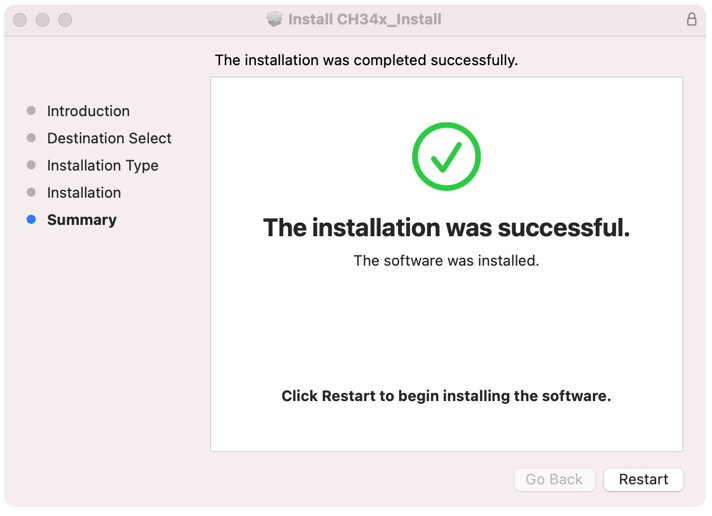
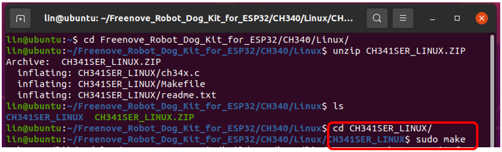
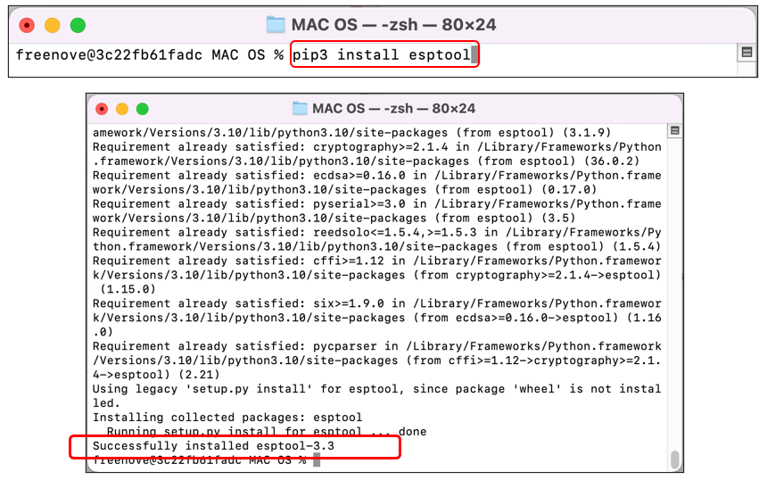
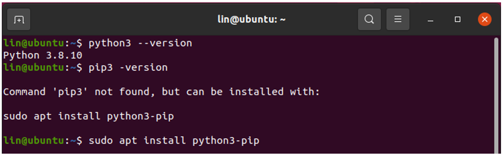

##############################################################################
Chapter 0 Install CH340 and Burn Firmware
##############################################################################

Check Firmware
******************

:red:`Please note that the firmware has been burnt by default, so generally, you do not need to burn it again.`

:red:`Please follow the steps below to check whether firmware has been burnt:`

+-----------------------------------------------------------------------------------------------------------+
| 1.Plug the ESP32 to the expansion board.                                                                  |
|                                                                                                           |
| |Chapter00_00|                                                                                            |
|                                                                                                           |
| :red:`Pay attention to the orientation of the ESP32 and make sure it is plugged in correctly; otherwise,` |
|                                                                                                           |
| :red:`it may damage the robot.`                                                                           |
+-----------------------------------------------------------------------------------------------------------+
| 2.Connect ESP32 to your computer with a USB cable.                                                        |
|                                                                                                           |
| After connecting, you can see the yellow LED on ESP32 stay ON and the blue LED blink twice every second.  |
|                                                                                                           |
| Meanwhile, the buzzer makes 4 warning sounds to tell you the camera has not yet been installed and then   |
|                                                                                                           |
| a pleasant sound to indicate the finish of initialization.                                                |
|                                                                                                           |
| |Chapter00_01|                                                                                            |
|                                                                                                           |
| If the above phenomenas happen, it means the firmware has been burnt.                                     |
+-----------------------------------------------------------------------------------------------------------+

:red:`If the firmware has been burnt on your robot, please skip to Chapter 1.`

:red:`Otherwise, please continue with the following steps.`

Please send emails to us (support@freenove.com) if you have any questions regarding the robot.

Install CH340 Driver
****************************

.. raw:: html

   <iframe height="500" width="690" src="https://www.youtube.com/embed/DfqqGdL_9hc" frameborder="0" allowfullscreen></iframe>

The computer uploads codes to ESP32 via CH340, so we need to install CH340 driver on our computer before using.

1.	First, download the CH340 driver. Click http://www.wch-ic.com/search?q=CH340&t=downloads to download the appropriate one based on your operating system.

If you would not like to download the installation package, you can open “:red:`Freenove_Robot_Dog_Kit_for_ESP32/CH340`”. We have prepared the installation package.

Next, we will explain how to install CH340 on different operating systems including Windows, Mac OS and Linux.

Windows
=============================

Check the Installation of CH340
------------------------------------------

1.	Connect esp32 to your computer with a USB cable.

2.	Right-click on “This PC” on your computer desktop and select “Manage”.

3.	 Click on “Device Manager” on the left of the pop-up window, and then click on “Ports” on the right. If your computer has installed CH340 driver, you can see the port: USB-SERIAL CH340 (COMx).

If so, you can click here to move to the next step.

If CH340 (COMx) does not show on your computer, you need to install CH340 driver.

Install CH340 Driver
-----------------------------------------

4.	Open “:red:`Freenove_Robot_Dog_Kit_for_ESP32/CH340/Windows/`”. 

5.	Double click to run the file “ **CH341SER.EXE** ”, whose interface is as below:

6.	Make sure ESP32 has connected to your computer and then click “INSTALL”. Wait for the installation to finish.

The following window indicates that the installation finishes.

7.	After installation, open device manager again and you can see the port USB-SERIAL CH340 (COMx).

So far, CH340 has been installed. Close all dialog boxes.

Mac OS
====================================

Check the Installation of CH340
-------------------------------------

Connect esp32 to your computer with a USB cable.

Open Terminal of Mac OS, and type in the command ls /dev/cu.usb*

If your Terminal prints the message similar to the above, then your computer has installed the CH340. You can click here to move to the next step.

Otherwise, please continue with the following the steps.

Install CH340
-----------------------------------

If you would not like to download the installation package, you can open “Freenove_Robot_Dog_Kit_for_ESP32/CH340”. We have prepared the installation package.

Open the folder “:red:`Freenove_Robot_Dog_Kit_for_ESP32/CH340/MAC/`”

Click Continue.

Click Install and wait for it to finish.

Restart your PC.

If CH340 is still not installed after the above steps, please refer to the ReadMe.pdf to install.

Burn the Firmware
*********************************

For this product, ESP32 has burned the required firmware by default. If your ESP32 does not have the firmware or the firmware does not work, please re-burn the firmware with the following steps.

We will explain respectively for Windows, Mac OS and Linux systems. 

Linux
=================================

Check the Installation of CH340
----------------------------------

Open the system terminal and type in the command: lsmod | grep usbserial. If your computer has installed the driver, you should see the following information:

If the driver has been installed, you can determine the port used by ESP32 to communicate with your computer in this way:

1.	When ESP32 is not connected to your computer, open system terminal and type in the command ls /dev/tty*

2.	Connect ESP32 to your computer with a USB cable and type in the command ls /dev/tty* again.

Compare the results. As shown below, :red:`/dev/ttyUSB0` is the port that ESP32 communicates with your computer.

If your computer has installed CH340, you can click here to skip to the next step.

Install CH340
--------------------------------------

If you connect the ESP32 to your computer but it does not detect /dev/ttyUSB0, then it has not installed CH340 yet.

Please follow the steps below to install CH340 driver.

We have prepared the installation package for you: “Freenove_Robot_Dog_Kit_for_ESP32/CH340/LINUX/”.

1.	Enter the folder on terminal: **cd Freenove_Robot_Dog_Kit_for_ESP32/CH340/Linux/**

2.	Unzip the installation package: unzip CH341SER_LINUX.ZIP

3.	Enter the unzipped folder and type in the command sudo make to compile and generate the file ch34x.ko.

4.	Use the ls command to check the file. As you can see below, the ch34.ko has been generated under the current directory.

5.	Type in the command to upload the file to the system: **sudo make load**

So far, the ch340 driver has been installed.

Windows
===================================

First, connect ESP32 to your computer with a USB cable. 

Second, open “windows.bat” under the directory of :red:`Freenove_Robot_Dog_Kit_for_ESP32/Firmware/Windows` with txt editor, and modify the COMx in the file according to the port USB-SERIAL CH340 (COMx) on your computer.

:red:`Note: Do NOT modify other contents.`

Third, save and close the file. Double-click it to run and wait for it to finish downloading.

Mac OS
====================================

1.	Open Terminal on your computer and type in the command python3 --version to check whether python3 has been installed on your computer.

If your computer has not yet installed python3, please type in the command to install: brew install python3

2.	Type in the command **pip3 --version** to check whether python3 has integrated with pip3. If it has not, please type in the command **curl https://bootstrap.pypa.io/get-pip.py | python3** to install. 

3.	Enter the command to install firmware-downloading tool: pip3 install esptool

4.	Check whether esptool has been installed: pip3 list

5.	Connect ESP32 to your computer with the USB cable.

.. image:: ../_static/imgs/0_Install_CH340_and_Burn_Firmware/Chapter00_34.png
    :align: center

6.	Open Mac OS Terminal and type in the command to check whether ESP32 can be detected: 

.. code-block:: console
    
    ls /dev/cu.usb*

The port number may vary among different computers. Here we take “/dev/cu.usbserial-14130” as an example. Copy the serial number.

7.	Open mac.py under the directory of Freenove_Robot_Dog_Kit_for_ESP32/Firmware/MAC OS/ with txt editor, and modify the port number to that of your computer. Save it and exit.

Note: Please make sure only the port number is changed and other information, including space is not changed; otherwise, the firmware may fail to burn.

8.	Enter the command: cd :red:`Freenove_Robot_Dog_Kit_for_ESP32/Firmware/MAC OS/` and python3 mac.py one by one to install the firmware to esp32.

9.	Wait for it to finish.

Linux
===================================

1.	Check whether your computer has installed python3. If it has, please skip to the next step.

If it has not, please run the command to install.

.. image:: ../_static/imgs/0_Install_CH340_and_Burn_Firmware/Chapter00_40.png
    :align: center

2.	Check whether pip3 has been installed on your computer. If it has, please move on to the next step. Otherwise, please run the following commands to install:

.. code-block:: console
    
    sudo apt update&

.. code-block:: console
    
    sudo apt install python3-pip

3.	Type in the command: pip3 install esptool

4.	Connect ESP32 to your computer with the USB cable.

5.	Enter the command **ls /dev/ttyUSB0** to check the port number. 

6.	Enter the command **sudo chmod 777 /dev/ttyUSB0**

.. note:: 
    
    The above command is to give permission to/dev/ttyUSB0. Without this, the code may fail to download.

7.	Enter the directory of :red:`Freenove_Robot_Dog_Kit_for_ESP32/Firmware/Linux` and enter the command **python3 linux.py**

8.	Wait for it to finish download.