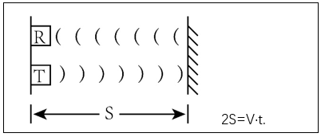
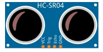
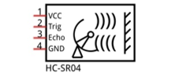
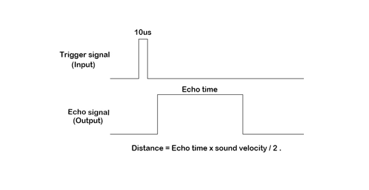
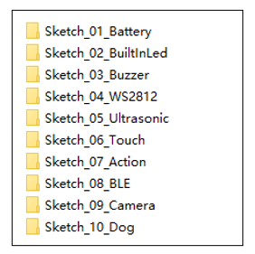
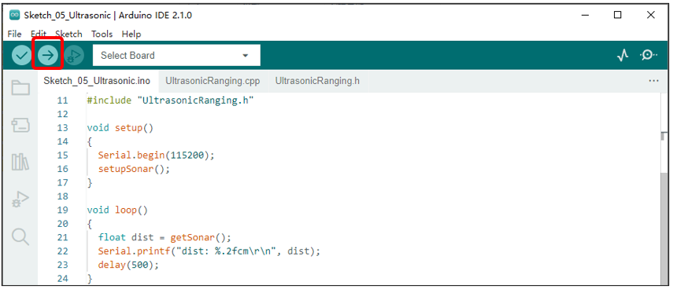

##############################################################################
Chapter 10 Ultrasonic Ranging
##############################################################################

**If you have any concerns, please feel free to contact us via** support@freenove.com

Component Knowledge
*******************************

The ultrasonic ranging module uses the principle that ultrasonic waves will be sent back when encounter obstacles. We can measure the distance by counting the time interval between sending and receiving of the ultrasonic waves, and the time difference is the total time of the ultrasonic wave's journey from being transmitted to being received. Because the speed of sound in air is a constant, about v=340m/s, we can calculate the distance between the ultrasonic ranging module and the obstacle: s=vt/2.

The HC-SR04 ultrasonic ranging module integrates both an ultrasonic transmitter and a receiver. The transmitter is used to convert electrical signals (electrical energy) into high frequency (beyond human hearing) sound waves (mechanical energy) and the function of the receiver is opposite of this. The picture and the diagram of the HC SR04 ultrasonic ranging module are shown below:

.. list-table:: 

    * - |Chapter10_01|
      - |Chapter10_02|

Pin description:

+------+------------------+
| Pin  |   Description    |
+======+==================+
| VCC  | power supply pin |
+------+------------------+
| Trig | trigger pin      |
+------+------------------+
| Echo | Echo pin         |
+------+------------------+
| GND  | GND              |
+------+------------------+

Technical specs:

Working voltage: 5V

Working current: 12mA

Minimum measured distance: 2cm

Maximum measured distance: 200cm

Instructions for use: output a high-level pulse in Trig pin lasting for least 10us, the module begins to transmit ultrasonic waves. At the same time, the Echo pin is pulled up. When the module receives the returned ultrasonic waves from encountering an obstacle, the Echo pin will be pulled down. The duration of high level in the Echo pin is the total time of the ultrasonic wave from transmitting to receiving, s=vt/2. 

Sketch
**********************************

In this chapter, we use GPIO32 of ESP32 as the Trig pin of the ultrasonic module, and GPIO12 as the Echo pin of the ultrasonic module.

Open “Sketch_05_Ultrasonic” folder in “ **Freenove_Robot_Dog_Kit_for_ESP32\\Sketches** ” and then double-click “Sketch_05_Ultrasonic.ino”.

Sketch_05_Ultrasonic
=================================

Upload the sketch to ESP32 and the robot will acquire ultrasonic data every 500 milliseconds and prints them out through the serial port.

The following is the code:

.. literalinclude:: ../../../freenove_Kit/Sketches/Sketch_05_Ultrasonic/Sketch_05_Ultrasonic.ino
    :linenos:
    :language: c
    :dedent:

Initialize the pins of the ultrasonic module.

.. literalinclude:: ../../../freenove_Kit/Sketches/Sketch_05_Ultrasonic/Sketch_05_Ultrasonic.ino
    :linenos:
    :language: c
    :lines: 15-15
    :dedent:

Get the data value of the ultrasonic module, the unit is cm.

.. literalinclude:: ../../../freenove_Kit/Sketches/Sketch_05_Ultrasonic/Sketch_05_Ultrasonic.ino
    :linenos:
    :language: c
    :lines: 19-19
    :dedent:

UltrasonicRanging.h
----------------------------------

.. literalinclude:: ../../../freenove_Kit/Sketches/Sketch_05_Ultrasonic/UltrasonicRanging.h
    :linenos:
    :language: c
    :dedent:

UltrasonicRanging.cpp
-------------------------------

.. literalinclude:: ../../../freenove_Kit/Sketches/Sketch_05_Ultrasonic/UltrasonicRanging.cpp
    :linenos:
    :language: c
    :dedent:

Ultrasonic module initialization function.

.. literalinclude:: ../../../freenove_Kit/Sketches/Sketch_05_Ultrasonic/UltrasonicRanging.cpp
    :linenos:
    :language: c
    :lines: 18-21
    :dedent:

The function that gets ultrasonic data.

.. literalinclude:: ../../../freenove_Kit/Sketches/Sketch_05_Ultrasonic/UltrasonicRanging.cpp
    :linenos:
    :language: c
    :lines: 22-40
    :dedent:

About function **pulseIn()**:

.. py::function:: int pulseIn(int pin, int level, int timeout);

    **pin:** the number of the Arduino pin on which you want to read the pulse. Allowed data types: int.
    
    **value:** type of pulse to read: either HIGH or LOW. Allowed data types: int.
    
    **timeout (optional):** the number of microseconds to wait for the pulse to start; default is one second. 