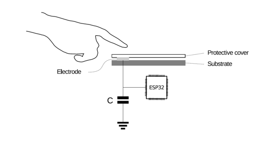
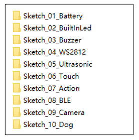
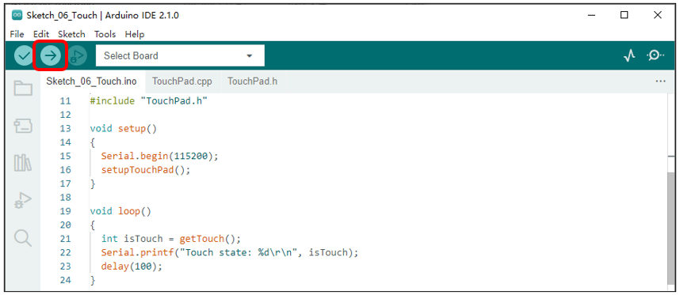
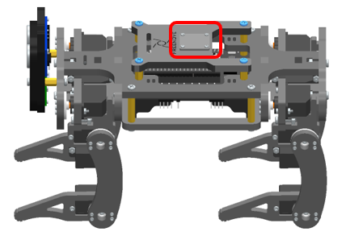

##############################################################################
Chapter 11 Touch
##############################################################################

If you have any concerns, please feel free to contact us via support@freenove.com

Component Knowledge
*******************************

Touch sensor
===============================

ESP32's touch sensor supports up to 10 GPIO channels as capacitive touch pins. Each pin can be used separately as an independent touch switch or be combined to produce multiple touch points. The following table is a list of available touch pins on ESP32.

.. table:: 
    :class: zebra
    :align: center

    +------------------------------+-------------------+-------------+
    | Name of touch sensing signal | Functions of pins | GPIO number |
    +==============================+===================+=============+
    | T0                           | GPIO4             | GPIO4       |
    +------------------------------+-------------------+-------------+
    | T1                           | GPIO0             | GPIO0       |
    +------------------------------+-------------------+-------------+
    | T2                           | GPIO2             | GPIO2       |
    +------------------------------+-------------------+-------------+
    | T3                           | MTDO              | GPIO15      |
    +------------------------------+-------------------+-------------+
    | T4                           | MTCK              | GPIO13      |
    +------------------------------+-------------------+-------------+
    | T5                           | MTDI              | GPIO12      |
    +------------------------------+-------------------+-------------+
    | T6                           | MTMS              | GPIO14      |
    +------------------------------+-------------------+-------------+
    | T7                           | GPIO27            | GPIO27      |
    +------------------------------+-------------------+-------------+
    | T8                           | 32K_XN            | GPIO33      |
    +------------------------------+-------------------+-------------+
    | T9                           | 32K_XP            | GPIO32      |
    +------------------------------+-------------------+-------------+
    
The touch pin number is already defined in ESP32's code base. For example, in the code, you can use T0 to represent GPIO4.

The electrical signals generated by touch are analog data, which are converted by an internal ADC converter. You may have noticed that all touch pins have ADC functionality.

The hardware connection method is shown in the following figure.

**In this chapter, we use the GPIO15 pin of ESP32 to simulate the touch function and read it.**

Sketch
********************************

Open “Sketch_06_Touch” folder in “Freenove_Robot_Dog_Kit_for_ESP32\\Sketches” and then double-click “Sketch_06_Touch.ino”.

Sketch_06_Touch
===============================

Upload the code to esp32, and the robot dog obtains the status of the touch sensor every 100 milliseconds and prints it out through the serial port. Touch the position circled in the figure below with your finger, and observe the changes in the content printed by the serial port.

The following is the code:

.. literalinclude:: ../../../freenove_Kit/Sketches/Sketch_06_Touch/Sketch_06_Touch.ino
    :linenos:
    :language: c
    :dedent:

Initialize touch sensing function pins.

.. literalinclude:: ../../../freenove_Kit/Sketches/Sketch_06_Touch/Sketch_06_Touch.ino
    :linenos:
    :language: c
    :lines: 15-15
    :dedent:

Get the status value of the touch sensor. When the sensor is not touched, the state value is 0. When it is touched, the status value is 1. The short press status value is 2, and the long press status value is 3.

.. literalinclude:: ../../../freenove_Kit/Sketches/Sketch_06_Touch/Sketch_06_Touch.ino
    :linenos:
    :language: c
    :lines: 19-19
    :dedent:

TouchPad.h
-------------------------------

.. literalinclude:: ../../../freenove_Kit/Sketches/Sketch_06_Touch/TouchPad.h
    :linenos:
    :language: c
    :dedent:

TouchPad.cpp
-------------------------------

.. literalinclude:: ../../../freenove_Kit/Sketches/Sketch_06_Touch/TouchPad.cpp
    :linenos:
    :language: c
    :dedent:

ESP32 touch function pin initialization.

.. literalinclude:: ../../../freenove_Kit/Sketches/Sketch_06_Touch/TouchPad.cpp
    :linenos:
    :language: c
    :lines: 35-58
    :dedent:

Touch sensor thread callback function.

.. literalinclude:: ../../../freenove_Kit/Sketches/Sketch_06_Touch/TouchPad.cpp
    :linenos:
    :language: c
    :lines: 112-117
    :dedent:

Touch function threshold setting function. When the sensor is touched, the internal capacitor discharges, and the data change can be detected at the touch pin. Here, 4/5 of the value of the touch sensor without contact is set as the threshold trigger range.

.. literalinclude:: ../../../freenove_Kit/Sketches/Sketch_06_Touch/TouchPad.cpp
    :linenos:
    :language: c
    :lines: 112-117
    :dedent:

Touch sensor interrupt trigger function. Execute this function every time the touch sensor is triggered, to set touchPadVal to true.

.. literalinclude:: ../../../freenove_Kit/Sketches/Sketch_06_Touch/TouchPad.cpp
    :linenos:
    :language: c
    :lines: 24-33
    :dedent: