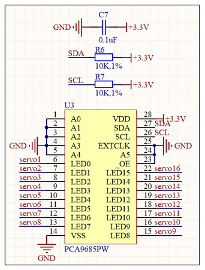
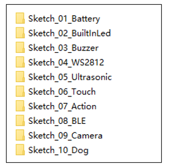
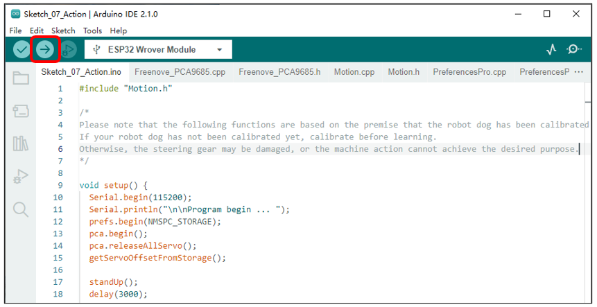
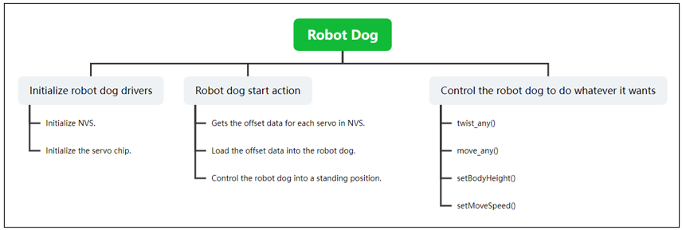

##############################################################################
Chapter 12 Basic Motion
##############################################################################

**If you have any concerns, please feel free to contact us via** support@freenove.com

Schematic
*****************************************

As shown in the picture, we connect the SDA and SCL pins of PCA9685 chip to GPIO13 and GPIO14 of ESP32 respectively. In this way, we can communicate with PCA9685 through IIC, and control the servo through PCA9685 to rotate to any angle.

Sketch
*****************************************

Open “Sketch_07_Action” folder in “ **Freenove_Robot_Dog_Kit_for_ESP32\\Sketches** ” and then double-click “Sketch_07_Action.ino”.

Sketch_07_Action
============================================

Upload the code to esp32 and the robot dog will make various actions.

Please note: If your robot dog has not been calibrated, please navigate back to :ref:`Chapter 2 <fnk0062/codes/tutorial/2_robot_assembly:chapter 2 robot assembly>` to calibrate the robot dog first.

The following is the code:

.. literalinclude:: ../../../freenove_Kit/Sketches/Sketch_07_Action/Sketch_07_Action.ino
    :linenos:
    :language: c
    :dedent:

Before controlling the robot dog to make various actions, you need to initialize the robot dog first, and get the calibration data of the servos from NVS If your robot dog has not been calibrated, please navigate back to :ref:`Chapter 2 <fnk0062/codes/tutorial/2_robot_assembly:chapter 2 robot assembly>` to calibrate the robot dog first.

.. literalinclude:: ../../../freenove_Kit/Sketches/Sketch_07_Action/Sketch_07_Action.ino
    :linenos:
    :language: c
    :lines: 12-15
    :dedent:

The robot dog action speed setting function, with the parameter ranging from 1 to 8. The larger the value, the faster the robot dog.

.. code-block:: c
    :linenos:

    void  setMoveSpeed(int spd);

The robot dog twisting function. By modifying different parameters, you can make the robot dog perform various body twisting movements.

.. code-block:: c
    :linenos:

    void twist_any(int alpha, int beta, int gama);

Robot dog movement function, by modifying the parameters, control the robot dog to go forward at any direction, any step length, any rotation Angle, and any speed.

.. code-block:: c
    :linenos:
    
    /*
     * @brief Walk command, any direction, any step length, any spin angle, any speed
     *
     * @param alpha is the moving direction, with the x-axis direction as 0 degrees, counterclockwise as positive, clockwise as negative, and the unit is angle, [0-360]. The x direction is the direction of forward movement.
     * @param stepLength The length of each step (<=20).
     * @param gama Spin angle, in-situ rotation, positive counterclockwise, negative clockwise, in degrees. [0-360].
     * @param spd Movement speed, unit: mm / 10ms.  [1,8]
     */
    void move_any(int alpha, float stepLength, int gama, int spd = 5);

Robot dog height setting function. The value ranges from 55 to 120.

.. code-block:: c
    :linenos:

    void setBodyHeight(int h);

Servo unloading function. Each time this function is called, the servos will lose torque

.. code-block:: c
    :linenos:

    pca.releaseAllServo();

Robot dog standing function. Every time this function is called, the robot dog will return to the standing position.

.. code-block:: c
    :linenos:

    standUp();