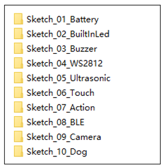
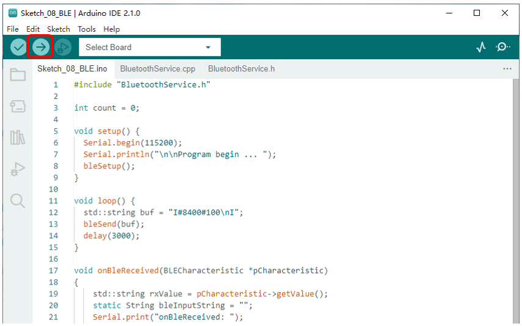
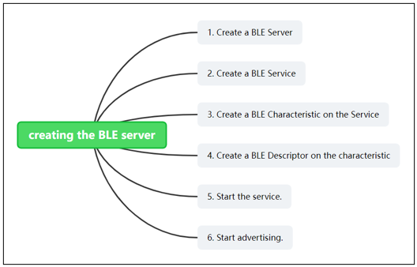

##############################################################################
Chapter 13 BLE
##############################################################################

**If you have any concerns, please feel free to contact us via** support@freenove.com

Sketch
*********************************

Open “Sketch_08_BLE” folder in “ **Freenove_Robot_Dog_Kit_for_ESP32\Sketches** ” and then double-click “Sketch_08_BLE.ino”.

Sketch_08_BLE
==================================

Upload the code to esp32. Open the serial monitor and set the baud rate to 115200. Connect the mobile APP to the robot dog, and you can see all the commands sent by the mobile terminal on the serial monitor.

BLE Bluetooth data transparent transmission routine:

The following is the code:

.. literalinclude:: ../../../freenove_Kit/Sketches/Sketch_08_BLE/Sketch_08_BLE.ino
    :linenos:
    :language: c
    :dedent:

BLE Bluetooth initialization function.

.. literalinclude:: ../../../freenove_Kit/Sketches/Sketch_08_BLE/Sketch_08_BLE.ino
    :linenos:
    :language: c
    :lines: 6-6
    :dedent:

BLE Bluetooth send data function.

.. literalinclude:: ../../../freenove_Kit/Sketches/Sketch_08_BLE/Sketch_08_BLE.ino
    :linenos:
    :language: c
    :lines: 11-11
    :dedent:

Bluetooth low energy data receiving function.

.. literalinclude:: ../../../freenove_Kit/Sketches/Sketch_08_BLE/Sketch_08_BLE.ino
    :linenos:
    :language: c
    :lines: 15-30
    :dedent:

BluetoothService.h
----------------------------------

.. literalinclude:: ../../../freenove_Kit/Sketches/Sketch_08_BLE/BluetoothService.h
    :linenos:
    :language: c
    :dedent:

BluetoothService.cpp
-----------------------------

.. literalinclude:: ../../../freenove_Kit/Sketches/Sketch_08_BLE/BluetoothService.cpp
    :linenos:
    :language: c
    :dedent: