##############################################################################
Chapter 15 Dog
##############################################################################

If you have any concerns, please feel free to contact us via support@freenove.com

Environment Installation
*****************************************

Install python3
===========================================

Download and install Python3 package.

https://www.python.org/downloads/release/python-381/ 

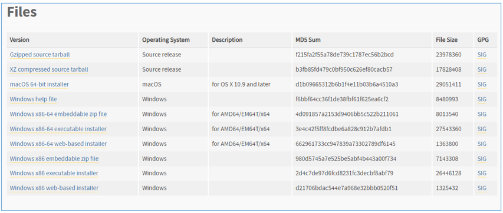

Choose the one matching to your computer version to download and install.

**Please note that “Add Python 3.8. to PATH” MUST be check.**

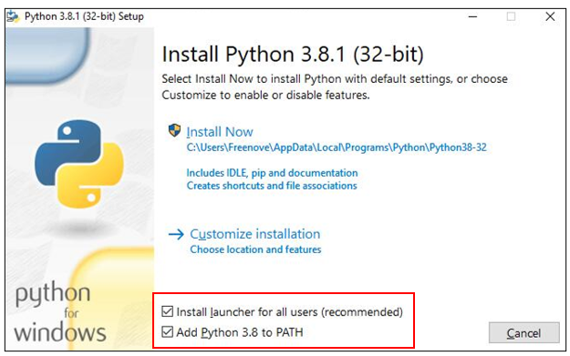

Check all the options and then click “Next”.

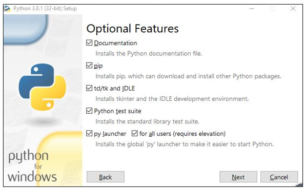

Here you can select the installation path of Python. We install it at D drive. If you are a novice, you can select the default path.

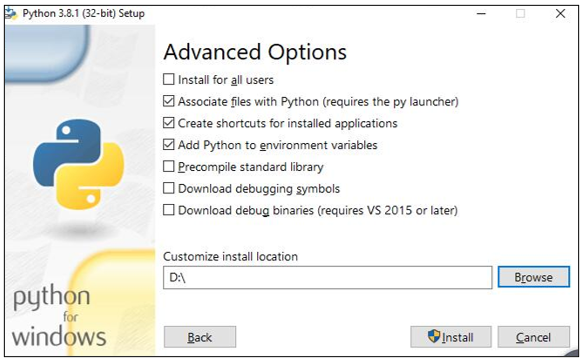

Wait for it to finish installing.

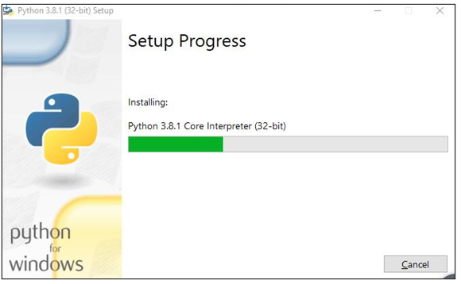

Now the installation is finished.

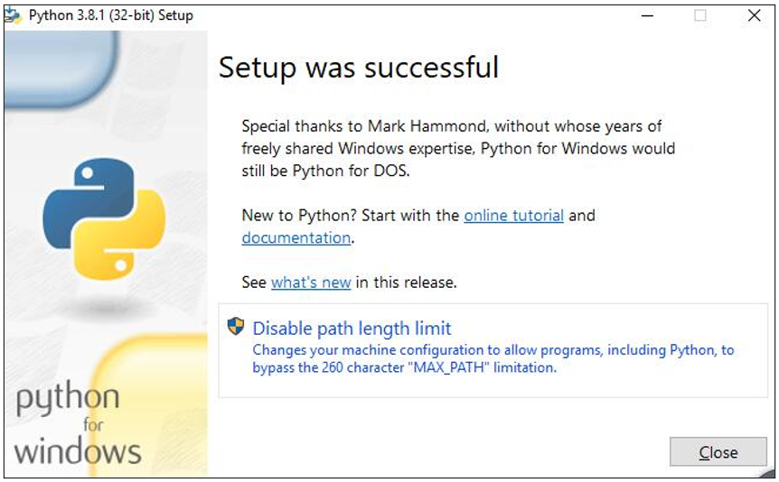

Install Freenove Board
=========================================

You can download it directly by clicking the link below, and unzip it manually.

https://github.com/Freenove/Freenove_ESP32_Robot_Dog_SDK_for_Arduino_IDE/archive/master.zip

Or download via the command

.. code-block:: console
    
    git clone https://github.com/Freenove/ Freenove_ESP32_Robot_Dog_SDK_for_Arduino_IDE.git

Here we take window installation as an example. Same steps for Linux and Mac.

Find the unzipped file directory, as shown in the figure below.

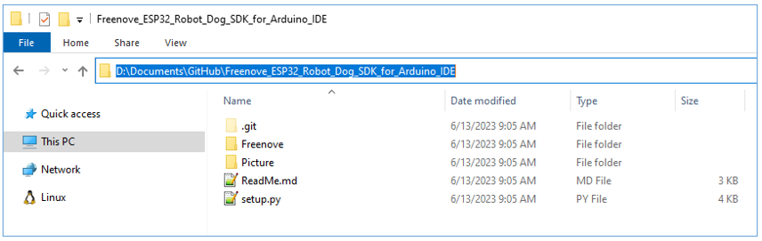

Type **cmd** in the address bar and press Enter. If you are on a Linux or Mac computer, you can use the terminal to enter the file directory.

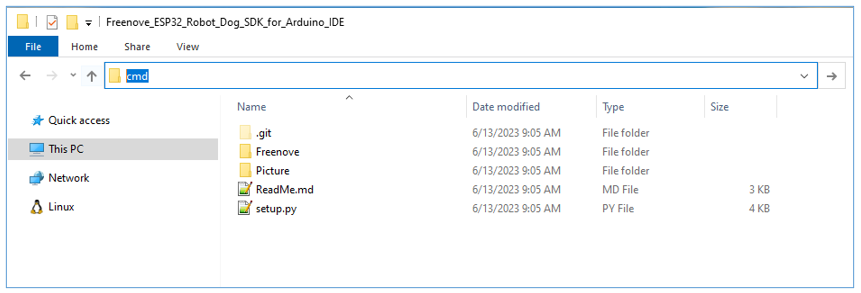

Type **python setup.py** in the cmd.

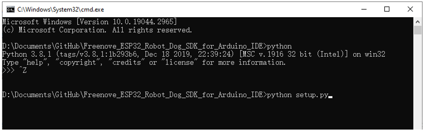

Wait for it to finish installation.

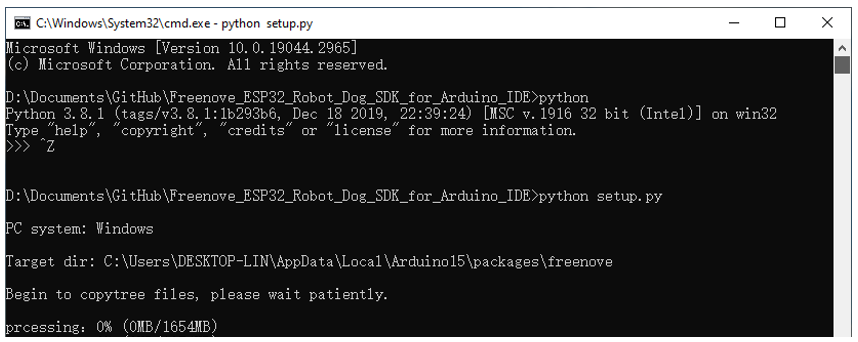

Restart Arduino IDE as per the prompt.

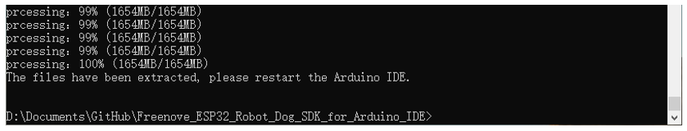

Sketch
*****************************************

Open “Sketch_10_Dog” folder in “ **Freenove_Robot_Dog_Kit_for_ESP32\\Sketches** ” and then double-click “Sketch_10_Dog.ino”.

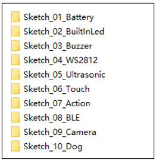

Sketch_10_Dog
========================================

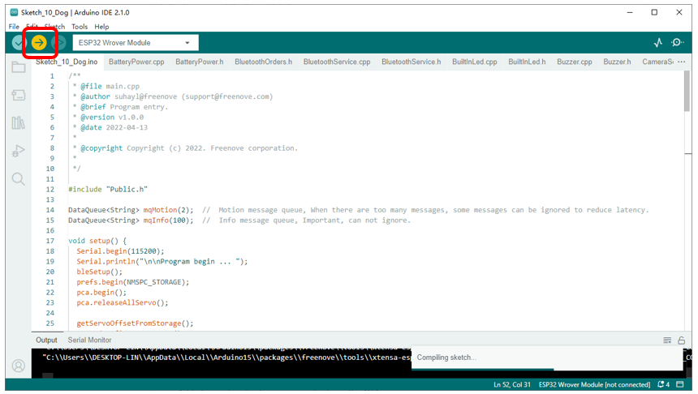

Upload the sketch to esp32 and you can control the robot dog to make any action as shown in Chapter 3.

Please note: If your robot dog has not been calibrated, please navigate back to :ref:`Chapter 2 <fnk0062/codes/tutorial/2_robot_assembly:chapter 2 robot assembly>` to calibrate the robot dog first.

The following is the code:

.. literalinclude:: ../../../freenove_Kit/Sketches/Sketch_10_Dog/Sketch_10_Dog.ino
    :linenos:
    :language: c
    :dedent:

Message queue. Each time instructions are received, they will be stored in a queue and waiting for the main thread to parse and execute it one by one.

.. literalinclude:: ../../../freenove_Kit/Sketches/Sketch_10_Dog/Sketch_10_Dog.ino
    :linenos:
    :language: c
    :lines: 14-15
    :dedent:

Initialize the robot dog's drivers.

.. literalinclude:: ../../../freenove_Kit/Sketches/Sketch_10_Dog/Sketch_10_Dog.ino
    :linenos:
    :language: c
    :lines: 18-33
    :dedent:

Receive commands by Serial.

.. literalinclude:: ../../../freenove_Kit/Sketches/Sketch_10_Dog/Sketch_10_Dog.ino
    :linenos:
    :language: c
    :lines: 71-81
    :dedent:

Receive commands by BLE.

.. literalinclude:: ../../../freenove_Kit/Sketches/Sketch_10_Dog/Sketch_10_Dog.ino
    :linenos:
    :language: c
    :lines: 83-95
    :dedent:

Receive commands by WiFi.

.. literalinclude:: ../../../freenove_Kit/Sketches/Sketch_10_Dog/Sketch_10_Dog.ino
    :linenos:
    :language: c
    :lines: 97-111
    :dedent:

Divide the commands into robot dog action commands and other commands according to the types and send them into the corresponding message queue.

.. literalinclude:: ../../../freenove_Kit/Sketches/Sketch_10_Dog/Sketch_10_Dog.ino
    :linenos:
    :language: c
    :lines: 119-137
    :dedent:

Events handled by the main thread.

.. literalinclude:: ../../../freenove_Kit/Sketches/Sketch_10_Dog/Sketch_10_Dog.ino
    :linenos:
    :language: c
    :lines: 45-56
    :dedent:

Events handled by the task thread.

.. literalinclude:: ../../../freenove_Kit/Sketches/Sketch_10_Dog/Sketch_10_Dog.ino
    :linenos:
    :language: c
    :lines: 58-69
    :dedent: