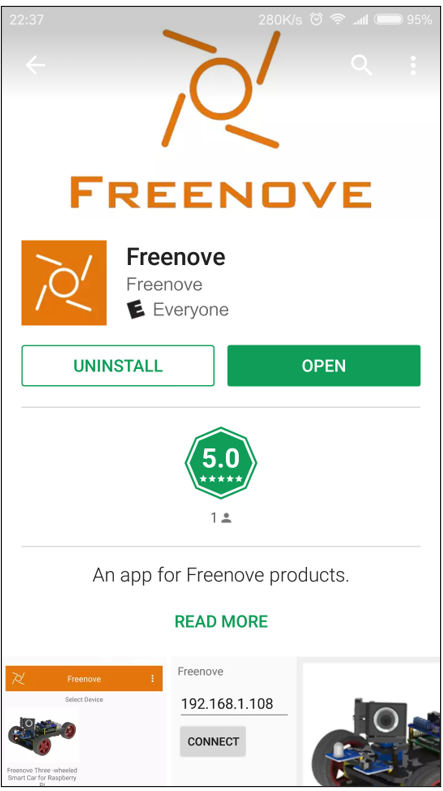
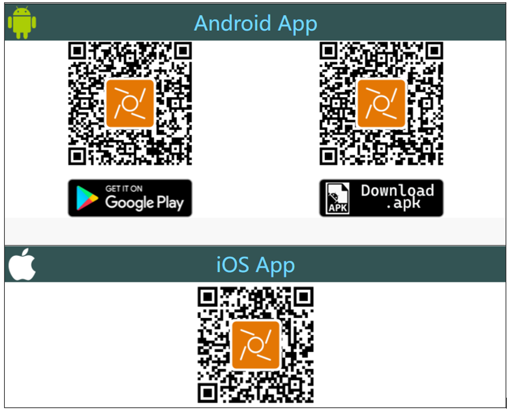
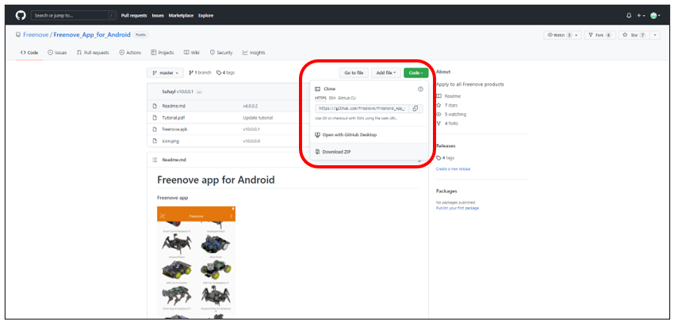
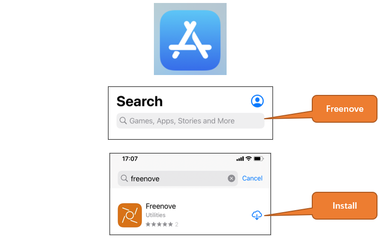
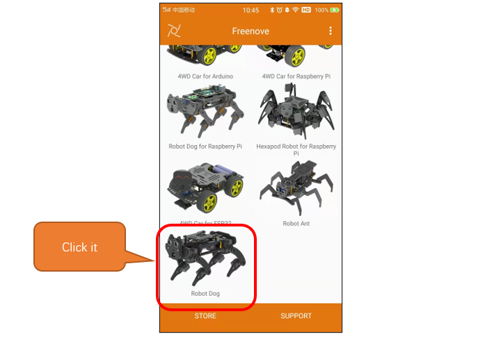
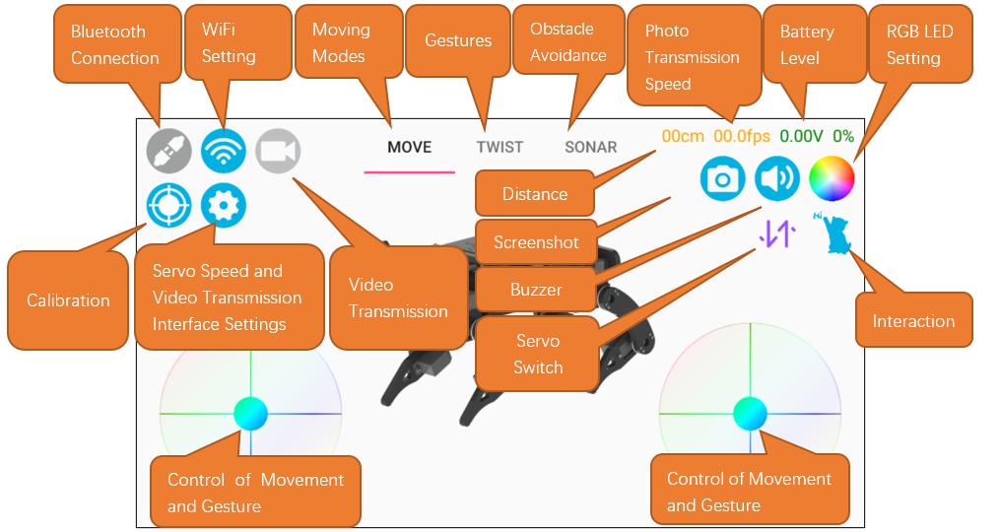

##############################################################################
Chapter 1 Install Freenove App
##############################################################################

Here are three installation methods. You can choose any one of them.

Install Freenove App
*************************************

Method 1
====================================

Open Google Play on your phone and search “Freenove” to download.

Method 2
====================================

Visit the website https://www.freenove.com/app.html with your computer and choose the one corresponding to your phone system to download, and then transfer it to your phone to install.

Method 3
====================================

Use your phone or computer to visit the website: https://github.com/Freenove/Freenove_app_for_Android, click Download ZIP under Code.

IOS
***************************************

Open the iPhone's APP Store, search Freenove and install it.

Introduction to Freenove App
*****************************************

Open the app and select the ESP32 robot Dog.

Before using the phone App to control the robot dog, we need to understand the interface first.

|