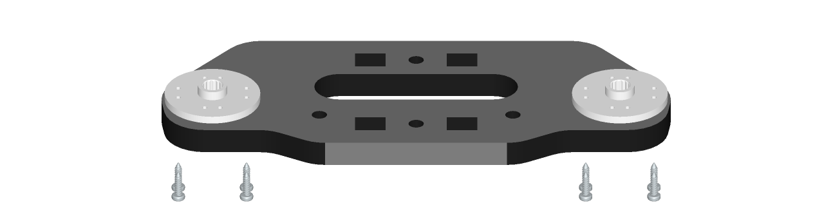
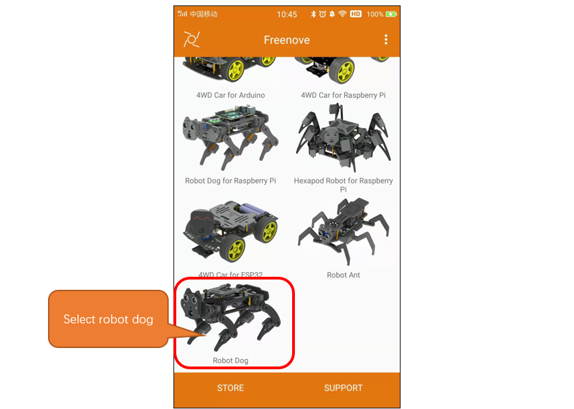
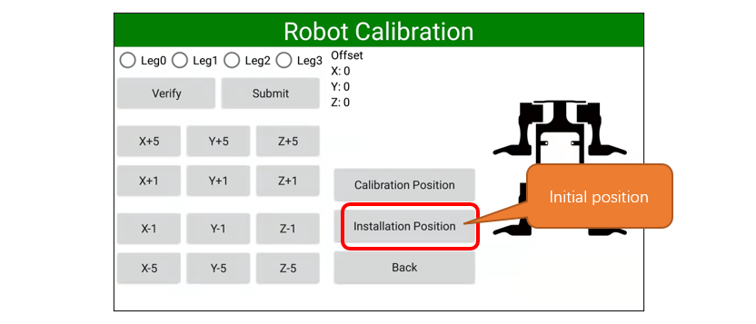
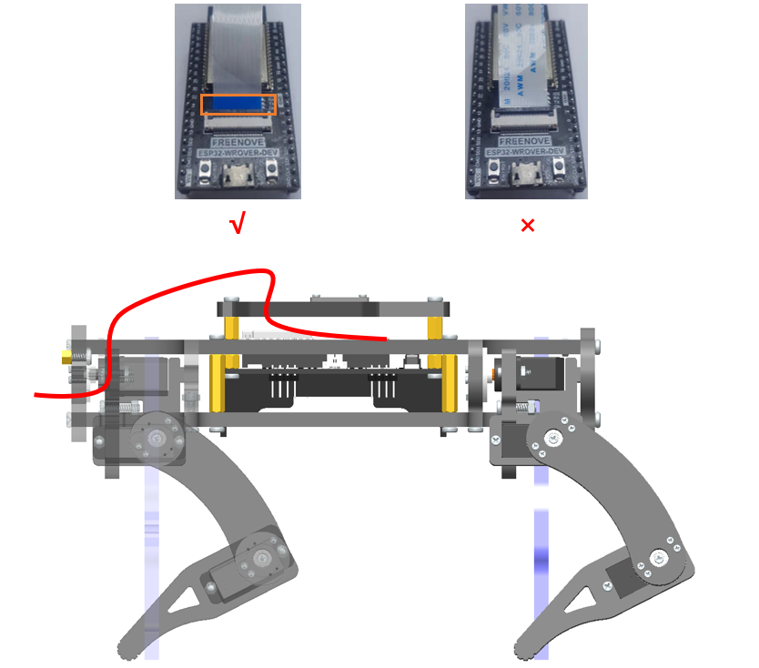
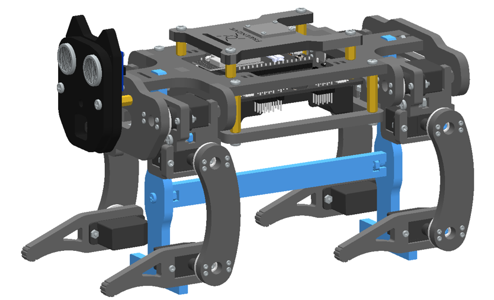
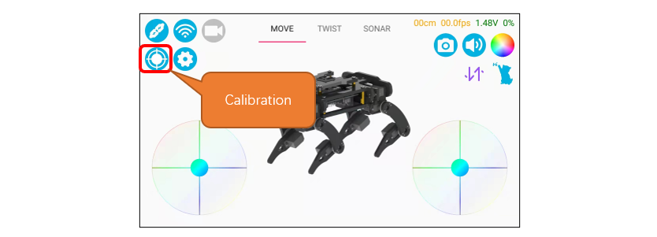

##############################################################################
Chapter 2 Robot Assembly
##############################################################################

.. raw:: html

   <iframe height="500" width="690" src="https://www.youtube.com/embed/J5U5l_wG7E8" frameborder="0" allowfullscreen></iframe>

Please follow the tutorial to assemble the robot; otherwise, it may not function well.

Step 1 Assembly of Disc Servo Arms 
******************************************************************************

+---------------------------------------------------+-------------------------------------+
|1.Take out 8 disc servo arms and 32 M1.4*8 screws from servo packages.                   |
|                                                                                         |
||Chapter02_00|                                                                           |
|                                                                                         |
+---------------------------------------------------+-------------------------------------+
|2.Mount two disc servo arms to the acrylic         |The front and back after assembly    |
|                                                   |                                     |
|part with eight M1.4*8 screws.                     |are as shown below.                  |
|                                                   |                                     |
|Below is a perspective view of the front and back. |                                     |
|                                                   ||Chapter02_02|                       |
||Chapter02_01|                                     |                                     |
|                                                   |                                     |
+---------------------------------------------------+-------------------------------------+
|Note: The distance between the two sets of holes is different.                           |
|                                                                                         |
|Please use the ones with longer distance.                                                |
|                                                                                         |
||Chapter02_03|                                                                           |
|                                                                                         |
+---------------------------------------------------+-------------------------------------+
|3.After assembly, you will get the following four parts.                                 |
|                                                                                         |
||Chapter02_04|                                                                           |
|                                                                                         |
+---------------------------------------------------+-------------------------------------+
|4.Mount two disc servo arms with eight M1.4*8 screws to the head board.                  |
|                                                                                         |
||Chapter02_05|                                                                           |
|                                                                                         |
+---------------------------------------------------+-------------------------------------+
|5.Mount two disc servo arms with eight M1.4*8 screws to the rear board.                  |
|                                                                                         |
||Chapter02_06|                                                                           |
|                                                                                         |
+---------------------------------------------------+-------------------------------------+

Step 2 Assembly of Body Bracket
************************************************

+---------------------------------------+---------------------------------------+
|1.Mount the below two acrylic parts to the bottom body bracket                 |
|                                                                               |
|with M3*12 screws and M3 nuts.                                                 |
|                                                                               |
||Chapter02_07|                                                                 |
|                                                                               |
+---------------------------------------+---------------------------------------+
|It should look as below after assembly.                                        |
|                                                                               |
|:red:`Pay attention to the direction of the rear board.`                       |
|                                                                               |
||Chapter02_08|                                                                 |
|                                                                               |
+---------------------------------------+---------------------------------------+
|2.Mount four M3*5+8 and four M3*10 brass standoffs to the top body bracket.    |
|                                                                               |
||Chapter02_09|                                                                 |
|                                                                               |
+---------------------------------------+---------------------------------------+
|3.Mount the board to the top body bracket with four M3*4 screws.               |
|                                                                               |
||Chapter02_10|                                                                 |
|                                                                               |
|After assembly:                                                                |
|                                                                               |
||Chapter02_11|                                                                 |
|                                                                               |
||Chapter02_12|                                                                 |
|                                                                               |
+---------------------------------------+---------------------------------------+

Step 3 Assembly of Legs 
*********************************************

+-------------------------------------------------+-------------------------------------------------+
|1.Mount four servos to four shanks with M2*10 screws and M2 nuts.                                  |
|                                                                                                   |
||Chapter02_13|                                                                                     |
|                                                                                                   |
+-------------------------------------------------+-------------------------------------------------+
|Left shank                                       |Right shank                                      |
|                                                 |                                                 |
||Chapter02_14|                                   ||Chapter02_15|                                   |
|                                                 |                                                 |
+-------------------------------------------------+-------------------------------------------------+
|2.Mount two servos to the below acrylic parts with M2*10 screws and M2 nuts.                       |
|                                                                                                   |
||Chapter02_16|                                                                                     |
|                                                                                                   |
+-------------------------------------------------+-------------------------------------------------+
|3.Mount two servos to the below acrylic parts with M2*10 screws and M2 nuts.                       |
|                                                                                                   |
||Chapter02_17|                                                                                     |
|                                                                                                   |
+-------------------------------------------------+-------------------------------------------------+
|4.Mount the two set of acrylic parts above with M3*12 screws and M3 nuts.                          |
|                                                                                                   |
||Chapter02_18|                                                                                     |
|                                                                                                   |
+-------------------------------------------------+-------------------------------------------------+
|5.Mount two servos to the below acrylic parts with M2*10 screws and M2 nuts.                       |
|                                                                                                   |
|:red:`Note: The direction is different from that in No.2!`                                         |
|                                                                                                   |
||Chapter02_19|                                                                                     |
|                                                                                                   |
+-------------------------------------------------+-------------------------------------------------+
|6.Mount two servos to the below acrylic parts with M2*10 screws and M2 nuts.                       |
|                                                                                                   |
|:red:`Note: The direction is different from that in No.3!`                                         |
|                                                                                                   |
||Chapter02_20|                                                                                     |
|                                                                                                   |
+-------------------------------------------------+-------------------------------------------------+
|7.Mount the two set of acrylic parts abovw with M3*12 screws and M3 nuts.                          |
|                                                                                                   |
||Chapter02_21|                                                                                     |
|                                                                                                   |
|:red:`Note: The direction is different from that in No.4!`                                         |
|                                                                                                   |
+-------------------------------------------------+-------------------------------------------------+
|Left                                             |Right                                            |
|                                                 |                                                 |
||Chapter02_22|                                   ||Chapter02_23|                                   |
|                                                 |                                                 |
+-------------------------------------------------+-------------------------------------------------+

Step 4 Adjustment of Servo Angles
*****************************************************

+--------------------------------------------------+--------------------------------------------------+
|1.Plug ESP32 into the driver board.                                                                  |
|                                                                                                     |
||Chapter02_24|                                                                                       |
|                                                                                                     |
|:red:`Pay attention to the orientation of the ESP32. Wrong installation may lead to damage.`         |
|                                                                                                     |
+--------------------------------------------------+--------------------------------------------------+
|2.Install the batteries.                                                                             |
|                                                                                                     |
||Chapter02_25|                                                                                       |
|                                                                                                     |
|:red:`Put in the batteries according to the silkscreen.`                                             |
|                                                                                                     |
|:red:`Wrong installation may result in malfunction.`                                                 |
|                                                                                                     |
+--------------------------------------------------+--------------------------------------------------+
|3.Plug in the servo cables to the servo connector pins randomly.                                     |
|                                                                                                     |
||Chapter02_26|                                                                                       |
|                                                                                                     |
|Pay attention to the color of the cable on each side.                                                |
|                                                                                                     |
||Chapter02_27|                                                                                       |
|                                                                                                     |
|G-GND (brown cable)                                                                                  |
|                                                                                                     |
|:red:`V-VCC (red cable)`                                                                             |
|                                                                                                     |
|:blue:`S-Signal (orange cable)`                                                                      |
|                                                                                                     |
|:red:`Note: Do NOT connect the cables in reverse.`                                                   |
|                                                                                                     |
|:red:`Otherwise, the servos will not work and be damaged.`                                           |
|                                                                                                     |
+--------------------------------------------------+--------------------------------------------------+
|4.Turn ON power switch.                                                                              |
|                                                                                                     |
||Chapter02_28|                                                                                       |
|                                                                                                     |
+--------------------------------------------------+--------------------------------------------------+
|5.Open Freenove App and select robot dog.                                                            |
|                                                                                                     |
||Chapter02_29|                                                                                       |
|                                                                                                     |
+--------------------------------------------------+--------------------------------------------------+
|6.Turn ON Bluetooth of your phone and tap the Connect button on the app.                             |
|                                                                                                     |
||Chapter02_30|                                                                                       |
|                                                                                                     |
+--------------------------------------------------+--------------------------------------------------+
|7.Select “Freenove-Dog-XXXXXXXX”.                                                                    |
|                                                                                                     |
||Chapter02_31|                                                                                       |
|                                                                                                     |
+--------------------------------------------------+--------------------------------------------------+
|8.Tap the calibration button.                                                                        |
|                                                                                                     |
||Chapter02_32|                                                                                       |
|                                                                                                     |
+--------------------------------------------------+--------------------------------------------------+
|9.Tap Installation Position and all the servos will rotate to 90 degrees.                            |
|                                                                                                     |
||Chapter02_33|                                                                                       |
|                                                                                                     |
|:red:`Note: The purpose of adjusting the angle of the servos is to ensure that there will not be`    |
|                                                                                                     |
|:red:`too much deviation after assembly to avoid malfunction.`                                       |
|                                                                                                     |
|:red:`Therefore, this step is very important.`                                                       |
|                                                                                                     |
+--------------------------------------------------+--------------------------------------------------+

Step 5 Assembly of Legs to Body
*****************************************************

:red:`Please keep power ON and all the servo cables connecting to the board during assembly.`

We need to ensure servos remain at 90 degrees when assembling. (Servo cables are not shown in the following instructions.)

+--------------------------------------------+--------------------------------------------+
| 1.Assemble the servos to the acrylic parts with black screws in servo packages.         |
|                                                                                         |
| Assemble them as close to 90 degrees as possible.                                       |
|                                                                                         |
| Angles at 70 - 110 degrees are acceptable.                                              |
|                                                                                         |
| |Chapter02_34|                                                                          |
+--------------------------------------------+--------------------------------------------+
| 2.Assemble the servos to the acrylic parts with black screws in servo packages.         |
|                                                                                         |
| Assemble them as close to 90 degrees as possible.                                       |
|                                                                                         |
| Angles at 70 - 110 degrees are acceptable.                                              |
|                                                                                         |
| |Chapter02_35|                                                                          |
|                                                                                         |
| Repeat the above step to make two same left legs.                                       |
|                                                                                         |
| |Chapter02_36|                                                                          |
+--------------------------------------------+--------------------------------------------+
| 3.Similar to the above steps, assemble two right legs.                                  |
|                                                                                         |
| |Chapter02_37|                                                                          |
+--------------------------------------------+--------------------------------------------+
| 4.Mount one left and one right legs to the rear board                                   |
|                                                                                         |
| with black screws in the servo package.                                                 |
|                                                                                         |
| |Chapter02_38|                                                                          |
|                                                                                         |
| Assemble them as close to 90 degrees as possible.                                       |
|                                                                                         |
| Angles at 70 - 110 degrees are acceptable.                                              |
|                                                                                         |
| |Chapter02_39|                                                                          |
+--------------------------------------------+--------------------------------------------+
| 5.Mount the rear board to the rear of the brackets with two M3*12 screws                |
|                                                                                         |
| and two M3 nuts.                                                                        |
|                                                                                         |
| |Chapter02_40|                                                                          |
+--------------------------------------------+--------------------------------------------+
| 6.Mount one left and one right leg to the front board with                              |
|                                                                                         |
| black servo screws in the servo package.                                                |
|                                                                                         |
| Assemble them as close to 90 degrees as possible.                                       |
|                                                                                         |
| Angles at 70 - 110 degrees are acceptable.                                              |
|                                                                                         |
| |Chapter02_41|                                                                          |
|                                                                                         |
| Note: After installing all Servo at 90 degrees, power can be turned off.                |
+--------------------------------------------+--------------------------------------------+
| 7.Mount two M3*10 standoffs to the front board with two M3*8 screws.                    |
|                                                                                         |
| |Chapter02_42|                                                                          |
+--------------------------------------------+--------------------------------------------+
| 8.Mount the front board to the head of body bracket with a M3*12 screw and a M3 nut.    |
|                                                                                         |
| |Chapter02_43|                                                                          |
+--------------------------------------------+--------------------------------------------+
| 9.Fix the body brackets with eight M3*8 screws and four M3*20 brass standoffs.          |
|                                                                                         |
| |Chapter02_44|                                                                          |
+--------------------------------------------+--------------------------------------------+

Step 6 Assembly of Head and Wire
******************************************

+-------------------------------------------------+-------------------------------------------------+
| 1.Connect the camera to its extension board.                                                      |
|                                                                                                   |
| |Chapter02_45|                                                                                    |
|                                                                                                   |
| :red:`Gently pull up the lock with your fingernail or a plastic stick.`                           |
|                                                                                                   |
| Remember to :red:`keep power OFF` when assembling the head to avoid damaging the camera.          |
+-------------------------------------------------+-------------------------------------------------+
| 2.Mount the camera and ultrasonic modules to the head acrylic part.                               |
|                                                                                                   |
| |Chapter02_46|                                                                                    |
+-------------------------------------------------+-------------------------------------------------+
| 3.                                                                                                |
|                                                                                                   |
| |Chapter02_47|                                                                                    |
|                                                                                                   |
| Plug one end of the camera cable into the camera extension board. Pay attention to blue side.     |
|                                                                                                   |
| |Chapter02_48|                                                                                    |
|                                                                                                   |
| Plug the other end into the ESP32.                                                                |
|                                                                                                   |
| |Chapter02_49|                                                                                    |
+-------------------------------------------------+-------------------------------------------------+
| 4.Connect the ultrasonic module to driver board with the 4P DuPont cable.                         |
|                                                                                                   |
| |Chapter02_50|                                                                                    |
+-------------------------------------------------+-------------------------------------------------+
| 5.Mount the two acrylic parts for head to the body with two M3*12 screws.                         |
|                                                                                                   |
| |Chapter02_51|                                                                                    |
+-------------------------------------------------+-------------------------------------------------+

Step 7 Assembly of the Cover
**********************************

+---------------------------------------------------------------------------+
| 1.Mount the touch sensor to the cover with four M1.4*5 screws.            |
|                                                                           |
| |Chapter02_68|                                                            |
+---------------------------------------------------------------------------+
| 2.Use a 3P wire to connect the touch module to the robot dog drive board. |
|                                                                           |
| The figure below does not show the acrylic part.                          |
|                                                                           |
| |Chapter02_69|                                                            |
+---------------------------------------------------------------------------+
| 3.Mount the cover to the robot with four M3*8 screws.                     |
|                                                                           |
| |Chapter02_70|                                                            |
+---------------------------------------------------------------------------+

Step 8 Servo Wiring
********************************

+-------------------------------------------------------------------+
| Reconnect the servo cables in accordance with the sequence below. |
|                                                                   |
| |Chapter02_52|                                                    |
|                                                                   |
| :red:`G-GND (brown cable)`                                        |
|                                                                   |
| :red:`V-VCC (red cable)`                                          |
|                                                                   |
| :red:`S-Signal (orange cable)`                                    |
|                                                                   |
| Note: Servo ports 3, 4, 11 and 12 are not connected by default.   |
+-------------------------------------------------------------------+

At this point, the robot dog has been assembled and can walk, but because it has not been calibrated, it cannot walk properly.  Calibration is a very important task that determines whether your robot dog can walk perfectly.  Please be patient with the next steps.  

Step 9 Assembly of Calibration Bracket
**********************************************

+--------------------------------------------------------------------------------+
| 1. Assemble the calibration bracket with two M3*12 screws and two M3 nuts.     |
|                                                                                |
| |Chapter02_53|                                                                 |
+--------------------------------------------------------------------------------+
| 2. Insert the calibration bracket into the robot dog to suspend the four legs. |
|                                                                                |
| |Chapter02_54|                                                                 |
+--------------------------------------------------------------------------------+

Step 10 Calibration
***********************************************

.. raw:: html

   <iframe height="500" width="690" src="https://www.youtube.com/embed/7AvrvcrucB0" frameborder="0" allowfullscreen></iframe>

+---------------------------------------------------------------------------------------------------------------+
| 1.Take out the calibration graph.                                                                             |
|                                                                                                               |
| |Chapter02_55|                                                                                                |
+---------------------------------------------------------------------------------------------------------------+
| 2.Put the robot on the calibration graph.                                                                     |
|                                                                                                               |
| |Chapter02_56|                                                                                                |
+---------------------------------------------------------------------------------------------------------------+
| 3.Turn ON the power switch on the driver board.                                                               |
|                                                                                                               |
| (Batteries are not included. Please buy them yourself.)                                                       |
|                                                                                                               |
| |Chapter02_57|                                                                                                |
+---------------------------------------------------------------------------------------------------------------+
| 4.Open Freenove App and tap Robot Dog.                                                                        |
|                                                                                                               |
| |Chapter02_58|                                                                                                |
+---------------------------------------------------------------------------------------------------------------+
| 5.Turn ON Bluetooth of your phone and tap the Connect button on the app.                                      |
|                                                                                                               |
| |Chapter02_59|                                                                                                |
+---------------------------------------------------------------------------------------------------------------+
| 6.Select “Freenove-Dog-XXXXXXXX”.                                                                             |
|                                                                                                               |
| |Chapter02_60|                                                                                                |
|                                                                                                               |
| If you do not turn ON the power or upload code to ESP32, you cannot find the Bluetooth of robot dog.          |
+---------------------------------------------------------------------------------------------------------------+
| 7.Tap the calibration button.                                                                                 |
|                                                                                                               |
| |Chapter02_61|                                                                                                |
+---------------------------------------------------------------------------------------------------------------+
| 8.Tap Installation Position and all the servos will rotate to 90 degrees.                                     |
|                                                                                                               |
| |Chapter02_62|                                                                                                |
+---------------------------------------------------------------------------------------------------------------+
| 9.The robot dog turns all Servo into 90 degree position.                                                      |
|                                                                                                               |
| As shown in the figure below.                                                                                 |
|                                                                                                               |
| Note: after pressing the button, :red:`if the Servo position in a different position`                         |
|                                                                                                               |
| :red:`from the following image, disassemble the Servo and install it in the correct position.`                |
|                                                                                                               |
| The smaller the deviation Angle, the better.                                                                  |
|                                                                                                               |
| |Chapter02_63|                                                                                                |
|                                                                                                               |
| |Chapter02_64|                                                                                                |
+---------------------------------------------------------------------------------------------------------------+
| 10.Introduction to the interface.                                                                             |
|                                                                                                               |
| |Chapter02_65|                                                                                                |
+---------------------------------------------------------------------------------------------------------------+
| 11.Select the leg to calibrate. Calibrate the legs by adjusting the X, Y and Z axes                           |
|                                                                                                               |
| to make the tiptoe match the point on the calibration graph.                                                  |
|                                                                                                               |
| |Chapter02_66|                                                                                                |
|                                                                                                               |
| Operation process of robot dog leg calibration:                                                               |
|                                                                                                               |
| 1.Select the leg to calibrate. Tap the calibration button to adjust                                           |
|                                                                                                               |
| the position until the tiptop match the point on calibration graph.                                           |
|                                                                                                               |
| 2.Tap "Submit" to upload the data after calibration to robot dog.                                             |
|                                                                                                               |
| Without this process, the result will not be saved.                                                           |
|                                                                                                               |
| 3.Repeat the above steps until all the four legs complete calibration.                                        |
+---------------------------------------------------------------------------------------------------------------+
| The robot after calibration is as shown below:                                                                |
|                                                                                                               |
| During the adjustment process, you can click the Verify button to Verify that the calibrated leg is accurate. |
|                                                                                                               |
| If it is not accurate, the leg needs to be recalibrated.                                                      |
|                                                                                                               |
| The corrected leg is allowed to have a certain error.                                                         |
|                                                                                                               |
| The error of +-5mm is allowed in the XZ direction.                                                            |
|                                                                                                               |
| The Y direction needs to hit the ground right, not jacking up the robot dog,                                  |
|                                                                                                               |
| and not hanging off the ground.                                                                               |
|                                                                                                               |
| |Chapter02_67|                                                                                                |
|                                                                                                               |
| By now, all the preparation work for robot dog has been done. You can now play the robot for fun.             |
+---------------------------------------------------------------------------------------------------------------+

