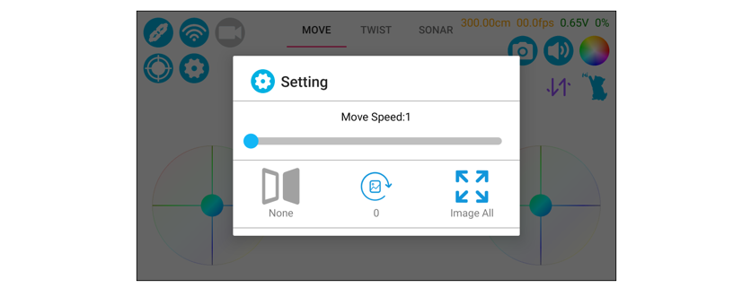

##############################################################################
Chapter 3 Functions of Freenove App
##############################################################################

Introduction to Main Interface
****************************************************

.. raw:: html

   <iframe height="500" width="690" src="https://www.youtube.com/embed/cuFT8CrPvqY" frameborder="0" allowfullscreen></iframe>

Wi-Fi Configuration
************************************

+-------------------------------------------------------------------------------------------------------------+
| 1. Tap Wi-Fi Setting button.                                                                                |
|                                                                                                             |
| |Chapter03_01|                                                                                              |
|                                                                                                             |
| 2. Introduction to Wi-Fi configuration interface.                                                           |
|                                                                                                             |
| A. To connect the robot dog to a Wi-Fi network, please select STAMode, which can connect the robot          |
|                                                                                                             |
| to a designated Wi-Fi.                                                                                      |
|                                                                                                             |
| B. When you are outdoors or without available Wi-Fi network, you can select APMode. It can create Wi        |
|                                                                                                             |
| -Fi network on the robot dog itself to connect to your phone.                                               |
|                                                                                                             |
| |Chapter03_02|                                                                                              |
+-------------------------------------------------------------------------------------------------------------+
| 3. Tap NewConn button to enter the Scan interface. Tap Scan button and select the Wi-Fi to be               |
|                                                                                                             |
| connected.                                                                                                  |
|                                                                                                             |
| |Chapter03_03|                                                                                              |
+-------------------------------------------------------------------------------------------------------------+
| 4. The interface of successful connection is as below.                                                      |
|                                                                                                             |
| |Chapter03_04|                                                                                              |
+-------------------------------------------------------------------------------------------------------------+
| 5. To use APMode, please tap the switch below and then connect your phone to the Wi-Fi shown on             |
|                                                                                                             |
| the right.                                                                                                  |
|                                                                                                             |
| |Chapter03_05|                                                                                              |
+-------------------------------------------------------------------------------------------------------------+
| 6. Tap Back to exit the configuration interface.                                                            |
|                                                                                                             |
| |Chapter03_06|                                                                                              |
+-------------------------------------------------------------------------------------------------------------+
| 7. After the robot dog connects to Wi-Fi network, tap the video transmission and your phone will            |
|                                                                                                             |
| display the frames captured by the robot.                                                                   |
|                                                                                                             |
| |Chapter03_07|                                                                                              |
|                                                                                                             |
| Tip: Tap the Interface Settings button and you can adjust the frames displayed on the phone.                |
|                                                                                                             |
| |Chapter03_08|                                                                                              |
|                                                                                                             |
| :red:`Note: Do not use speed above class 6 for long periods of time as there is a risk of damage to Servo.` |
+-------------------------------------------------------------------------------------------------------------+

RGB LED Control
****************************

+----------------------------------------------------------------------------------------------------------+
| 1. Tap RGB LED control function.                                                                         |
|                                                                                                          |
| |Chapter03_09|                                                                                           |
+----------------------------------------------------------------------------------------------------------+
| 2. The left and right arrows are used to switch the LED modes, the slider to control the brightness and  |
|                                                                                                          |
| the color palette to set the color.                                                                      |
|                                                                                                          |
| |Chapter03_10|                                                                                           |
+----------------------------------------------------------------------------------------------------------+

Interaction Function
******************************

+------------------------------------------------------------------------------------------------+
| 1. Tap the Interaction button.                                                                 |
|                                                                                                |
| |Chapter03_11|                                                                                 |
|                                                                                                |
| Tip: Tapping the up and down arrow icon can make the robot dog lie down and unload the servos. |
+------------------------------------------------------------------------------------------------+
| 2. The robot dog can do different actions with different actions being tapped.                 |
|                                                                                                |
| |Chapter03_12|                                                                                 |
+------------------------------------------------------------------------------------------------+

