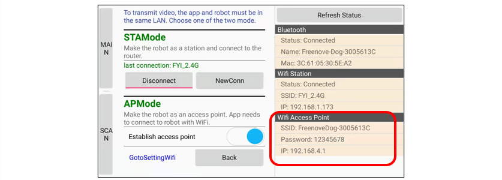

##############################################################################
Chapter 4 Q&A
##############################################################################

.. table:: 
    :class: table-line
    :width: 80%
    :align: center

    +---------------------------------------------------------------------------------------------------------------+
    | 1.The buzzer makes four warning sound after powered ON.                                                       |
    |                                                                                                               |
    | Reason: The robot makes the sounds indicating that data cannot be obtained from the camera.                   |
    |                                                                                                               |
    | Troubleshooting:                                                                                              |
    |                                                                                                               |
    | a. The camera does not contact well with the extension board.                                                 |
    |                                                                                                               |
    | Please remove and reconnect the camera to try again.                                                          |
    |                                                                                                               |
    | |Chapter04_00|                                                                                                |
    |                                                                                                               |
    | b. The FPC cable does not contact well with the extension board.                                              |
    |                                                                                                               |
    | Please remove and reconnect the cable.                                                                        |
    |                                                                                                               |
    | |Chapter04_01|                                                                                                |
    |                                                                                                               |
    | c. The FPC cable does not contact well with the extension board.                                              |
    |                                                                                                               |
    | Please remove and reconnect the cable.                                                                        |
    |                                                                                                               |
    | |Chapter04_02|                                                                                                |
    |                                                                                                               |
    | d. The camera may be damaged. Please try to connect the camera to esp32 directly to test.                     |
    |                                                                                                               |
    | If the issue remains, then the camera module is damaged.                                                      |
    |                                                                                                               |
    | Please send us an email (support@freenove.com) to solve the issue.                                            |
    |                                                                                                               |
    | |Chapter04_03|                                                                                                |
    +---------------------------------------------------------------------------------------------------------------+
    | 2.When using the video transmission function, the Bluetooth is disconnected.                                  |
    |                                                                                                               |
    | Reason: As the Bluetooth and WIFI of ESP32 share the same antenna and a large amount of data is               |
    |                                                                                                               |
    | transmitted through WIFI during video transmission, turning off Bluetooth can better reduce the               |
    |                                                                                                               |
    | interference with WIFI communication. Therefore, once the video transmission function is used, the robot's    |
    |                                                                                                               |
    | Bluetooth is turned off by default, and both commands and video transmission are communicated                 |
    |                                                                                                               |
    | through WIFI.                                                                                                 |
    +---------------------------------------------------------------------------------------------------------------+
    | 3.When using the video transmission function, sometimes the response of the robot dog is not timely.          |
    |                                                                                                               |
    | Reason: When the robot dog uses video transmission, only WIFI is enabled for communication. Whether it        |
    |                                                                                                               |
    | has a lag depends on whether the signal of the router connected to the robot dog is stable.  If the WIFI      |
    |                                                                                                               |
    | signal is poor at some point, it will cause the robot dog to be stuck.                                        |
    +---------------------------------------------------------------------------------------------------------------+
    | 4.It is better to control the robot dog using Bluetooth rather than WIFI when not using video transmission.   |
    |                                                                                                               |
    | Reason: When not transmitting videos, little data is transferred between the mobile APP and the robot dog.    |
    |                                                                                                               |
    | In this case, both WIFI and Bluetooth can control the robot dog well, but the WIFI function may be affected   |
    |                                                                                                               |
    | by the router signal, while the Bluetooth function does not have such problem, as it is directly sent by the  |
    |                                                                                                               |
    | robot dog to the mobile phone. Therefore, it is strongly recommended to use the Bluetooth function to         |
    |                                                                                                               |
    | control the robot dog, and turn off WIFI to increase the stability of the Bluetooth function when video       |
    |                                                                                                               |
    | transmission is not used.                                                                                     |
    +---------------------------------------------------------------------------------------------------------------+
    | 5.Q: Which mode is better? Can both modes be enabled simultaneously?                                          |
    |                                                                                                               |
    | A: When not using video transmission, you can turn on Bluetooth and WIFI at the same time. However,           |
    |                                                                                                               |
    | they share the same control commands, so we recommend turning off WIFI and only enabling Bluetooth,           |
    |                                                                                                               |
    | which almost causes no lag.                                                                                   |
    |                                                                                                               |
    | When using video transmission, the robot's Bluetooth is turned off by default to avoid interference to the    |
    |                                                                                                               |
    | WIFI function.                                                                                                |
    +---------------------------------------------------------------------------------------------------------------+
    | 6.Q: The WIFI has STA and AP modes, which one should I choose when using video transmission?                  |
    |                                                                                                               |
    | A: If there is a router with great signal available, we recommend using STA mode; otherwise, AP mode is       |
    |                                                                                                               |
    | recommended.                                                                                                  |
    |                                                                                                               |
    | Note: In AP mode, you need to connect your phone to the robot's hotspot, whose SSID and password are          |
    |                                                                                                               |
    | as follows:                                                                                                   |
    |                                                                                                               |
    | |Chapter04_04|                                                                                                |
    +---------------------------------------------------------------------------------------------------------------+

