##############################################################################
Chapter 5 Arduino Software
##############################################################################

Chapters starting with this chapter are introductions to the robot code. If you are interested in it, you can continue to read.

The content of this chapter is the installation and configuration of the Arduino IDE, the platform for robot dog code.

Arduino Software
**********************************

Arduino Software (IDE) is used to write and upload the code for Arduino Board.

First, install Arduino Software (IDE): visit https://www.arduino.cc, click "Download" to enter the download page.

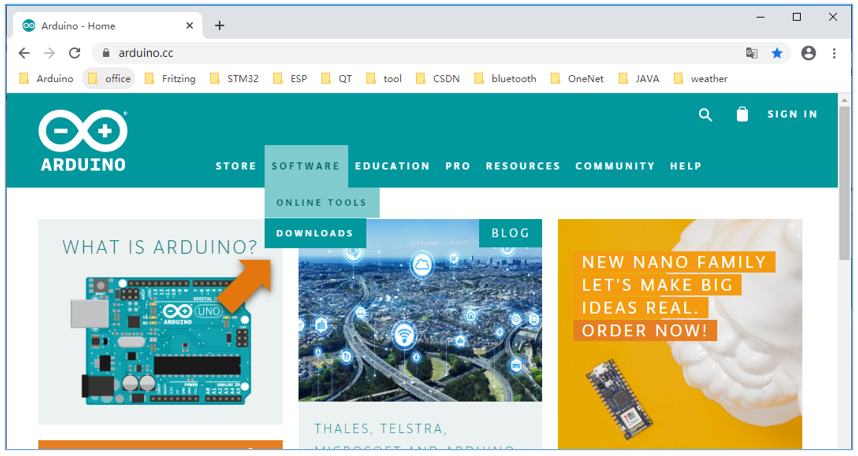

Select and download corresponding installer according to your operating system. If you are a Windows user, please select the "Windows Installer" to download and install the driver correctly.

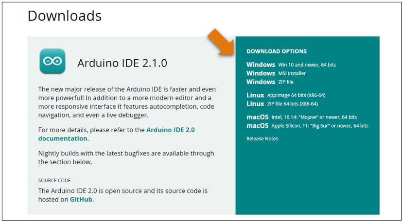

After the download completes, run the installer. For Windows users, there may pop up an installation dialog during the installation. When it popes up, please allow the installation.

After installation is completed, an Arduino Software shortcut will be generated in the desktop. Run the Arduino Software.

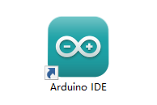

The interface of Arduino Software is as follows:

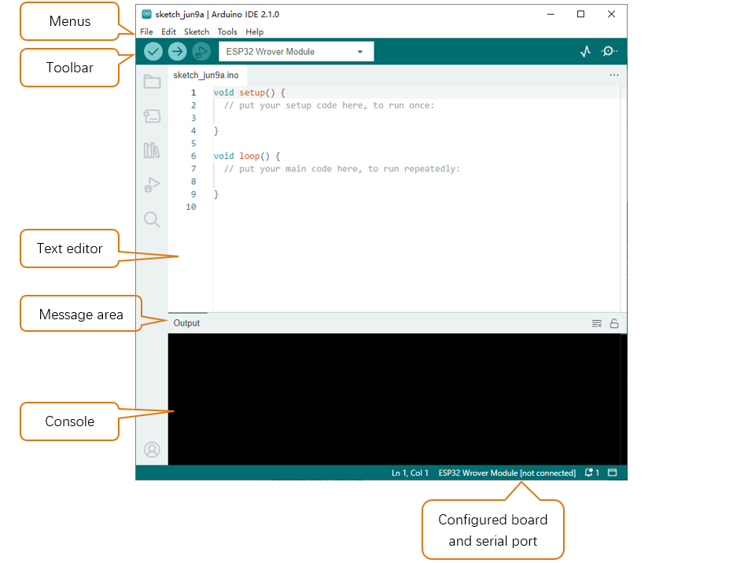

Programs written with Arduino Software (IDE) are called sketches. These sketches are written in the text editor and saved with the file extension.ino. The editor has features for cutting/pasting and searching/replacing text. The message area gives feedback while saving and exporting and also displays errors. The console displays text output by the Arduino Software (IDE), including complete error messages and other information. The bottom right-hand corner of the window displays the configured board and serial port. The toolbar buttons allow you to verify and upload programs, create, open, and save sketches, and open the serial monitor.

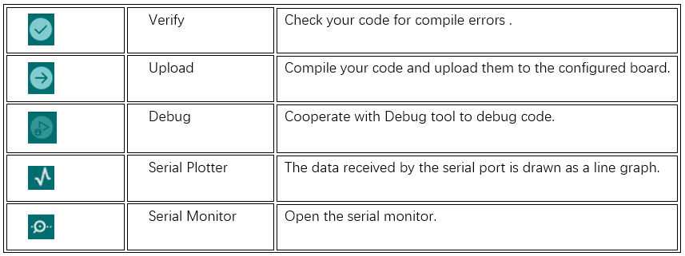

Additional commands are found within the five menus: File, Edit, Sketch, Tools, Help. The menus are context sensitive, which means only those items relevant to the work currently being carried out are available.

Environment Configuration
********************************

First, open the software platform arduino, and then click File in Menus and select Preferences.

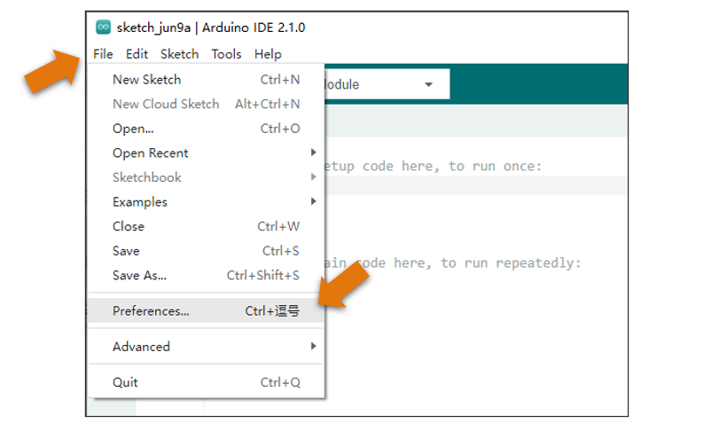

Second, click on the symbol behind "Additional Boards Manager URLs" 

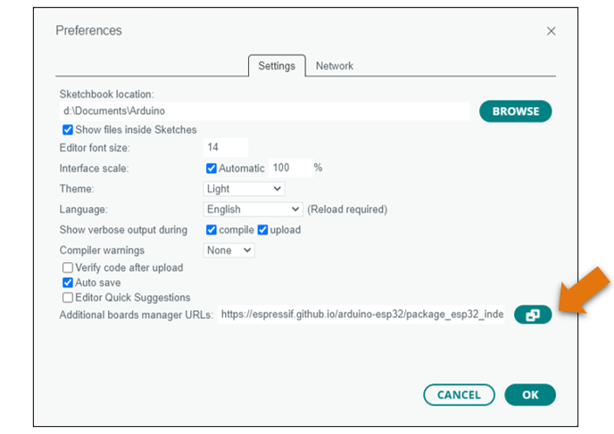

Third, fill in https://espressif.github.io/arduino-esp32/package_esp32_index.json in the new window, click OK, and click OK on the Preferences window again.

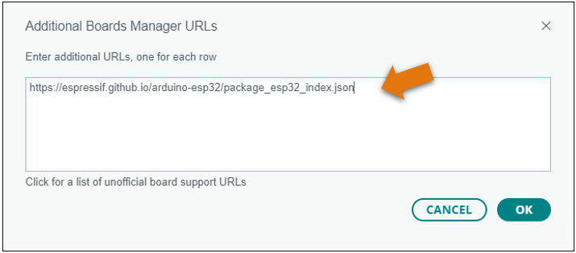

Fourth, click Tools in Menus, select Board: "Arduino Uno", and then select "Boards Manager".

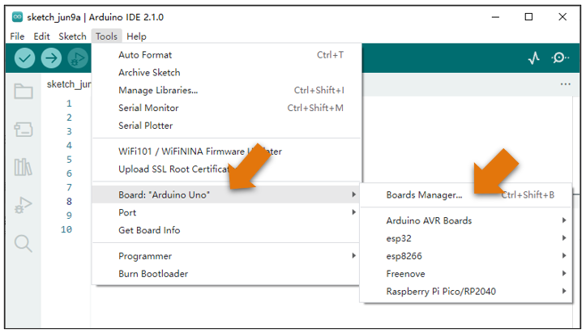

Fifth, input "esp32" in the window below, and press Enter. Select version 2.0.2. Click "Install" to install.

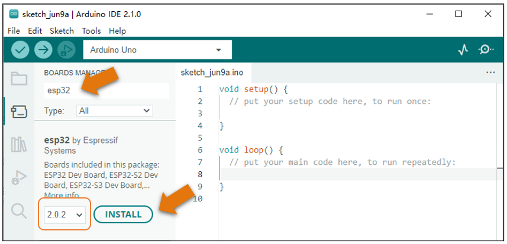

When finishing installation, click Tools in the Menus again and select Board: "Arduino Uno", and then you can see information of ESP32-WROVER. click "ESP32-WROVER" so that the ESP32 programming development environment is configured.

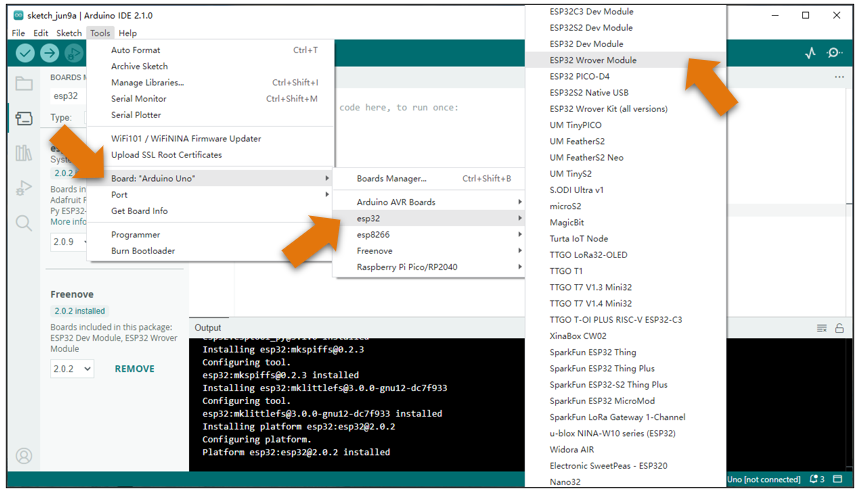