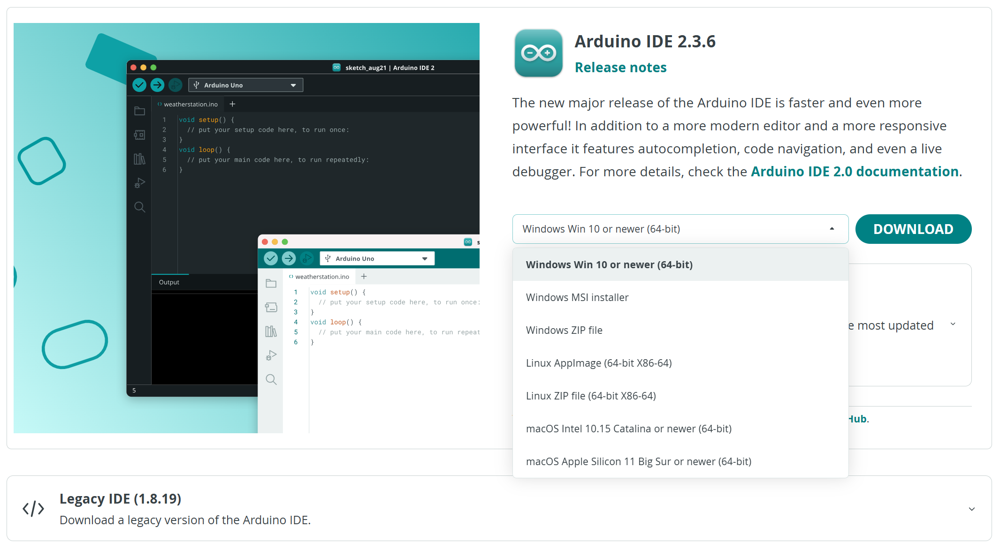
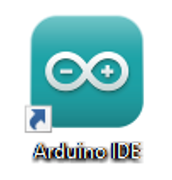

##############################################################################
Chapter 5 Arduino Software
##############################################################################

Chapters starting with this chapter are introductions to the robot code. If you are interested in it, you can continue to read.

The content of this chapter is the installation and configuration of the Arduino IDE, the platform for robot dog code.

Arduino Software
**********************************

Arduino Software (IDE) is used to write and upload the code for Arduino Board.

First, install Arduino Software (IDE): visit https://www.arduino.cc/en/software/

Select and download corresponding installer based on your operating system. If you are a Windows user, please select the "Windows" to download and install the driver correctly.

.. image:: ../_static/imgs/5_Arduino_Software/Preface04.png
    :align: center

After the downloading completes, run the installer. For Windows users, there may pop up an installation dialog box of driver during the installation process. When it is popped up, please allow the installation.

After installation is completed, an shortcut will be generated in the desktop.

Run it. The interface of the software is as follows:

.. image:: ../_static/imgs/5_Arduino_Software/Preface06.png
    :align: center

Programs written with Arduino IDE are called sketches. These sketches are written in a text editor and are saved with the file extension.ino. The editor has features for cutting/pasting and for searching/replacing text. The console displays text output by the Arduino IDE, including complete error messages and other information. The bottom right-hand corner of the window displays the configured board and serial port. The toolbar buttons allow you to verify and upload programs, open the serial monitor, and access the serial plotter.

.. table::
    :align: center
    :class: table-line
    :width: 80%
    
    +-------------+---------------------------------------------------------------------+
    | |Preface07| | Verify                                                              |
    |             |                                                                     |
    |             | Checks your code for errors compiling it.                           |
    +-------------+---------------------------------------------------------------------+
    | |Preface08| | Upload                                                              |
    |             |                                                                     |
    |             | Compiles your code and uploads it to the configured board.          |
    +-------------+---------------------------------------------------------------------+
    | |Preface09| | Debug                                                               |
    |             |                                                                     |
    |             | Troubleshoot code errors and monitor program running status.        |
    +-------------+---------------------------------------------------------------------+
    | |Preface10| | Serial Plotter                                                      |
    |             |                                                                     |
    |             | Real-time plotting of serial port data charts.                      |
    +-------------+---------------------------------------------------------------------+
    | |Preface11| | Serial Monitor                                                      |
    |             |                                                                     |
    |             | Used for debugging and communication between devices and computers. |
    +-------------+---------------------------------------------------------------------+

.. |Preface08| image:: ../_static/imgs/5_Arduino_Software/Preface08.png
.. |Preface09| image:: ../_static/imgs/5_Arduino_Software/Preface09.png
.. |Preface10| image:: ../_static/imgs/5_Arduino_Software/Preface10.png
.. |Preface11| image:: ../_static/imgs/5_Arduino_Software/Preface11.png

Environment Configuration
********************************

First, open the software platform arduino, and then click File in Menus and select Preferences.

.. image:: ../_static/imgs/5_Arduino_Software/Chapter05_05.png
    :align: center

Second, click on the symbol behind "Additional Boards Manager URLs" 

.. image:: ../_static/imgs/5_Arduino_Software/Chapter05_06.png
    :align: center

Third, fill in https://espressif.github.io/arduino-esp32/package_esp32_index.json in the new window, click OK, and click OK on the Preferences window again.

.. image:: ../_static/imgs/5_Arduino_Software/Chapter05_07.png
    :align: center

Fourth, click Tools in Menus, select Board: "Arduino Uno", and then select "Boards Manager".

.. image:: ../_static/imgs/5_Arduino_Software/Chapter05_08.png
    :align: center

Fifth, input "esp32" in the window below, and press Enter. Select version 2.0.2. Click "Install" to install.

.. image:: ../_static/imgs/5_Arduino_Software/Chapter05_09.png
    :align: center

When finishing installation, click Tools in the Menus again and select Board: "Arduino Uno", and then you can see information of ESP32-WROVER. click "ESP32-WROVER" so that the ESP32 programming development environment is configured.

.. image:: ../_static/imgs/5_Arduino_Software/Chapter05_10.png
    :align: center