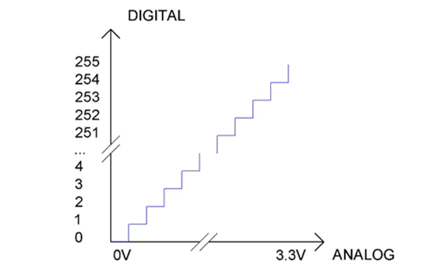
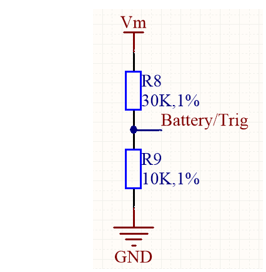
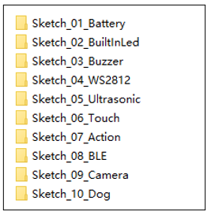
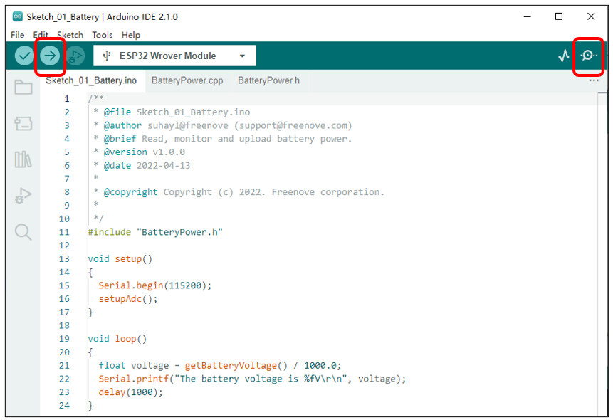
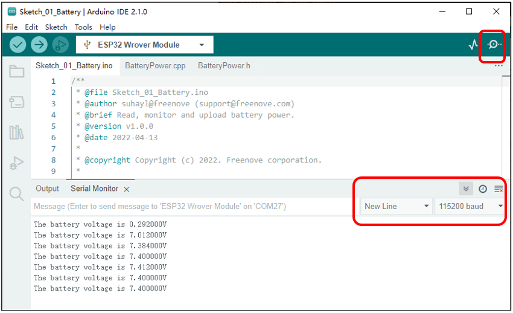

##############################################################################
Chapter 6 Battery
##############################################################################

**If you have any concerns, please feel free to contact us via** support@freenove.com

Related knowledge
*******************************************

ADC
==========================================

An ADC is an electronic integrated circuit used to convert analog signals such as voltages to digital or binary form consisting of 1s and 0s. The range of our ADC on ESP32 is 12 bits, that means the resolution is 2^12=4096, and it represents a range (at 3.3V) will be divided equally to 4096 parts. The rage of analog values corresponds to ADC values. So the more bits the ADC has, the denser the partition of analog will be and the greater the precision of the resulting conversion.

Subsection 1: the analog in rang of 0V---3.3/4095 V corresponds to digital 0;

Subsection 2: the analog in rang of 3.3/4095 V---2*3.3 /4095V corresponds to digital 1;

...

The following analog will be divided accordingly.

The conversion formula is as follows:

.. math:: 

    ADC Value=(Analog Voltage)/3.3*4095

Schematic
*****************************************

As we can see, the robot reads the voltage of the batteries through GPIO32 of ESP32. Because the battery voltage is not read frequently, this GPIO is also used to control the Ultrasonic.

As shown in the figure above, the positive pole Vm of the power supply is controlled by the switch.

1. When the switch is turned on, the voltage value of VM is the voltage value of the battery.

2. Battery/Trig is connected to GPIO32 pin of ESP32.

3. The voltage acquisition range of GPIO32 on ESP32 is 0-3.3V, while the robot dog is powered by two 18650 lithium batteries, and the voltage is 8.4V when fully charged, which exceeds the voltage acquisition range of ESP32. Therefore, after passing through the voltage divider circuit composed of R3 and R4, the voltage at Battery/Trig is about 1/4 of the battery voltage, 8.4 / 4 = 2.1V, which is within the voltage acquisition range of GPIO32.

Sketch
******************************************

In this section, we will use GPIO32 of ESP32 to read the voltage value of the batteries and print it on serial monitor. Open “Sketch_01_Battery” folder in “Freenove_Robot_Dog_Kit_for_ESP32\Sketches” and then double-click “Sketch_01_Battery.ino”.

Sketch_01_Battery
==========================================

Click the upload button in the upper left corner to upload the code to esp32. Open the serial monitor in the upper right corner and set the baud rate to 115200.

The following is the code:

.. literalinclude:: ../../../freenove_Kit/Sketches/Sketch_01_Battery/Sketch_01_Battery.ino
    :linenos:
    :language: c
    :dedent:

In the Arduino IDE, the setup() function is usually used as an initialization function, and the code is executed only once. Serial.begin() is the initialization function of the serial port. The parameter in the bracket indicates the speed of the serial port communication, and the unit is usually Bit. The baud rate is set to 115200 here, which means that 115200 bits of data are transmitted within one second. The setupAdc() function is used to initialize the battery voltage pin of the esp32.

.. literalinclude:: ../../../freenove_Kit/Sketches/Sketch_01_Battery/Sketch_01_Battery.ino
    :linenos:
    :language: c
    :lines: 13-17
    :dedent:

In the Arduino IDE, the loop() function is usually used as a repeated execution function, and the code in the function will be executed in an infinite loop. The getBatteryVoltage() function is used to obtain the voltage value of the battery in millivolts.

The Serial.printf() function can print the content processed by ESP32 to the serial monitor through the serial port.

delay(x) is a delay function in milliseconds. Every time it is called, it causes the code execution to pause for x milliseconds,

.. literalinclude:: ../../../freenove_Kit/Sketches/Sketch_01_Battery/Sketch_01_Battery.ino
    :linenos:
    :language: c
    :lines: 19-24
    :dedent:

BatteryPower.h
-----------------------------------

.. literalinclude:: ../../../freenove_Kit/Sketches/Sketch_01_Battery/BatteryPower.h
    :linenos:
    :language: c
    :dedent:

BatteryPower.cpp
-----------------------------------

.. literalinclude:: ../../../freenove_Kit/Sketches/Sketch_01_Battery/BatteryPower.cpp
    :linenos:
    :language: c
    :dedent:

ADC data sampling accuracy setting. Here it is set to 12 bits. 2^12=4096, so the sampling data range of ADC is 0-4095.

.. literalinclude:: ../../../freenove_Kit/Sketches/Sketch_01_Battery/BatteryPower.cpp
    :linenos:
    :language: c
    :lines: 16-16
    :dedent:

ADC sampling voltage range setting of ESP32, which is 0-3.3V. ADC_11db represents the maximum range. Combined with the above analogReadResolution() function, when the voltage of the ADC collection point is 0V, the value collected by the ADC is 0; when the voltage of the ADC collection point is 3.3V, the value collected by the ADC is 4095.

.. literalinclude:: ../../../freenove_Kit/Sketches/Sketch_01_Battery/BatteryPower.cpp
    :linenos:
    :language: c
    :lines: 17-17
    :dedent:

Associate the ADC configuration to the pin.

.. literalinclude:: ../../../freenove_Kit/Sketches/Sketch_01_Battery/BatteryPower.cpp
    :linenos:
    :language: c
    :lines: 18-18
    :dedent:

Use analogRead(PIN_ANALOG_IN) to capture the ADC value at the ESP32 pin.

Continuously collect NUM_OF_SAMPLES ADC values at the ESP32 pins and calculate the average.

.. literalinclude:: ../../../freenove_Kit/Sketches/Sketch_01_Battery/BatteryPower.cpp
    :linenos:
    :language: c
    :lines: 23-28
    :dedent:

Convert the ADC value to the actual measured voltage value. The unit is millivolts.

.. literalinclude:: ../../../freenove_Kit/Sketches/Sketch_01_Battery/BatteryPower.cpp
    :linenos:
    :language: c
    :lines: 30-30
    :dedent:

We know from the previous introduction that the voltage at the ESP32 pin is 1/4 of the battery voltage. Therefore, the voltage value of the battery can be obtained by multiplying the voltage value measured by the ADC by VOLATAGE_RATIO(4).

.. literalinclude:: ../../../freenove_Kit/Sketches/Sketch_01_Battery/BatteryPower.cpp
    :linenos:
    :language: c
    :lines: 31-31
    :dedent: