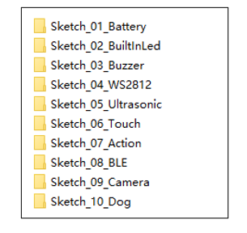
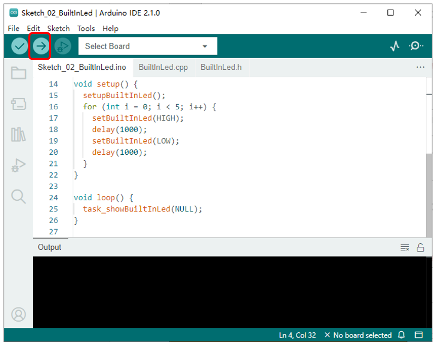
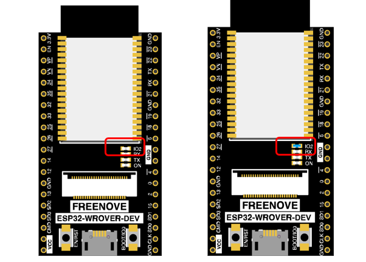

##############################################################################
Chapter 7 Built-in Led
##############################################################################

**If you have any concerns, please feel free to contact us via** support@freenove.com

Schematic
*************************************

There are four LED lights on the ESP32 development board. ON is the power indicator, TX and RX are indicators for communication or code upload status, and IO2 is the onboard indicator light., which is connected on the GPIO2 pin of the ESP32. 

As shown in the figure above, when the ESP32 outputs a high level, the onboard indicator will light up. When the ESP32 outputs a low level, the onboard indicator light will be off. We can use it to indicate the running state of our code.

Sketch
****************************************

Open “Sketch_02_BuiltInLed” folder in “ **Freenove_Robot_Dog_Kit_for_ESP32\\Sketches** ” and then double-click “Sketch_02_BuiltInLed.ino”.

Sketch_02_BuiltInLed
===========================================

Click the upload button in the upper left corner to upload the code to esp32. The LED on the ESP32 board will turn on and off every 1 second for 5 times, and enter the flash mode.

The following is the code:

.. literalinclude:: ../../../freenove_Kit/Sketches/Sketch_02_BuiltInLed/Sketch_02_BuiltInLed.ino
    :linenos:
    :language: c
    :dedent:

Initializes the pins that control the onboard LEDs.

.. literalinclude:: ../../../freenove_Kit/Sketches/Sketch_02_BuiltInLed/Sketch_02_BuiltInLed.ino
    :linenos:
    :language: c
    :lines: 25-25
    :dedent:

Use the setBuiltInLed(bool) function to control the on-board LED to turn on or off.

The LED light on the control board turns on and off every 1 second, which repeats 5 times.

.. literalinclude:: ../../../freenove_Kit/Sketches/Sketch_02_BuiltInLed/Sketch_02_BuiltInLed.ino
    :linenos:
    :language: c
    :lines: 16-21
    :dedent:

BuiltInLed.h
-----------------------------------

.. literalinclude:: ../../../freenove_Kit/Sketches/Sketch_02_BuiltInLed/BuiltInLed.h
    :linenos:
    :language: c
    :dedent:

BuiltInLed.cpp
-----------------------------------

.. literalinclude:: ../../../freenove_Kit/Sketches/Sketch_02_BuiltInLed/BuiltInLed.cpp
    :linenos:
    :language: c
    :dedent:

Onboard LED initialization function.

.. literalinclude:: ../../../freenove_Kit/Sketches/Sketch_02_BuiltInLed/BuiltInLed.cpp
    :linenos:
    :language: c
    :lines: 22-24
    :dedent:

The function that controls the on-board LED to turn on or off.

.. literalinclude:: ../../../freenove_Kit/Sketches/Sketch_02_BuiltInLed/BuiltInLed.cpp
    :linenos:
    :language: c
    :lines: 26-28
    :dedent:

Enter the if statement every occasionally. This usage has the same effect as the delay() function, but it will not cause the code to be pause.

.. literalinclude:: ../../../freenove_Kit/Sketches/Sketch_02_BuiltInLed/BuiltInLed.cpp
    :linenos:
    :language: c
    :lines: 33-33
    :dedent:

Control the LED's on and off states by shifting a variable, sqValue, and taking the least significant bit as the control signal.

If the current state of the LED is different from the previous state, control the LED to change its current state and update the previous state to the current state.

.. literalinclude:: ../../../freenove_Kit/Sketches/Sketch_02_BuiltInLed/BuiltInLed.cpp
    :linenos:
    :language: c
    :lines: 36-41
    :dedent:

Introducing a variable called bitIndex to control the shift amount, so as to change the number of shifts performed on sqValue each time,. If the number of shifts exceeds 9, the next time entering the if condition will be delayed by 600ms, and sqValue starts shifting from the 0th bit again. 

.. literalinclude:: ../../../freenove_Kit/Sketches/Sketch_02_BuiltInLed/BuiltInLed.cpp
    :linenos:
    :language: c
    :lines: 42-48
    :dedent:

If the previous shift cycle is completed, set the time for entering the if condition to 100ms each time and proceed to the next shift cycle.

.. literalinclude:: ../../../freenove_Kit/Sketches/Sketch_02_BuiltInLed/BuiltInLed.cpp
    :linenos:
    :language: c
    :lines: 50-53
    :dedent: