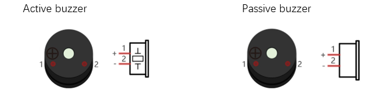
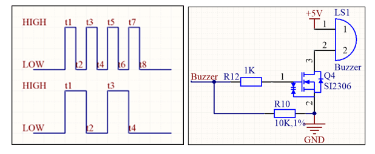
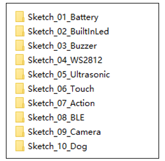
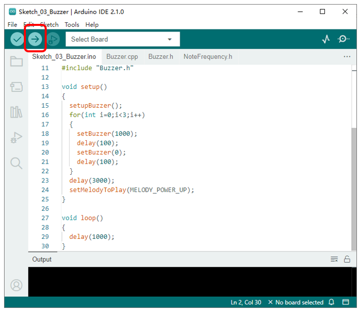

##############################################################################
Chapter 8 Buzzer
##############################################################################

**If you have any concerns, please feel free to contact us via** support@freenove.com

Component knowledge
**********************************************

Buzzer
============================================

Buzzer is a sounding component, which is widely used in electronic devices such as calculator, electronic warning clock and alarm. Buzzer has two types: active and passive. Active buzzer has oscillator inside, which will sound as long as it is supplied with power. Passive buzzer requires external oscillator signal (generally use PWM with different frequency) to make a sound.

Active buzzer is easy to use. Generally, it can only make a specific frequency of sound. Passive buzzer requires an external circuit to make a sound, but it can be controlled to make a sound with different frequency. The resonant frequency of the passive buzzer is 2kHz, which means the passive buzzer is loudest when its resonant frequency is 2kHz.

Next, we will use an active buzzer to make a doorbell and a passive buzzer to make an alarm.

Schematic
=============================================

As shown in the figure below, we connect a buzzer to GPIO33 of ESP32. When GPIO33 outputs high level, the buzzer circuit is turned on; when GPIO33 outputs low level, the buzzer circuit is turned off. Since the buzzer is a passive buzzer, when we switch quickly between high and low levels, we can control the passive buzzer to make a sound. The frequency of the sound depends on the duration of the high and low levels (f=1/T, T=t1+t2).

Sketch
***********************************************

Open “Sketch_03_Buzzer” folder in “ **Freenove_Robot_Dog_Kit_for_ESP32\\Sketches** ” and then double-click “Sketch_03_Buzzer.ino”.

Sketch_03_Buzzer
==============================================

Upload the sketch and the buzzer will beep three times at a fixed frequency and then emit a pleasant sound.

The following is the code:

.. literalinclude:: ../../../freenove_Kit/Sketches/Sketch_03_Buzzer/Sketch_03_Buzzer.ino
    :linenos:
    :language: c
    :dedent:

Initialize the buzzer pin.

.. literalinclude:: ../../../freenove_Kit/Sketches/Sketch_03_Buzzer/Sketch_03_Buzzer.ino
    :linenos:
    :language: c
    :lines: 14-14
    :dedent:

Control the passive buzzer to emit a sound at specific frequency.

.. literalinclude:: ../../../freenove_Kit/Sketches/Sketch_03_Buzzer/Sketch_03_Buzzer.ino
    :linenos:
    :language: c
    :lines: 16-16
    :dedent:

Each time this function is called, a thread will be created and a melody will be played. The thread will be closed after playback is complete.

.. literalinclude:: ../../../freenove_Kit/Sketches/Sketch_03_Buzzer/Sketch_03_Buzzer.ino
    :linenos:
    :language: c
    :lines: 22-22
    :dedent:

Buzzer.h
-------------------------------

.. literalinclude:: ../../../freenove_Kit/Sketches/Sketch_03_Buzzer/Buzzer.h
    :linenos:
    :language: c
    :dedent:

Buzzer.cpp
-------------------------------

.. literalinclude:: ../../../freenove_Kit/Sketches/Sketch_03_Buzzer/Buzzer.cpp
    :linenos:
    :language: c
    :dedent:

Define the pin for the buzzer. ESP32's PWM channel, number of bits, and frequency.

.. literalinclude:: ../../../freenove_Kit/Sketches/Sketch_03_Buzzer/Buzzer.cpp
    :linenos:
    :language: c
    :lines: 14-17
    :dedent:

Configure the pin to control the buzzer: 

1. Configure the PWM channel, frequency, and number of digits. 

2. Associate the PWM signal output channel with the pin that controls the buzzer. 

3. Control the duty cycle of the PWM channel to 0. 

4. Control the buzzer to make no sound.

.. literalinclude:: ../../../freenove_Kit/Sketches/Sketch_03_Buzzer/Buzzer.cpp
    :linenos:
    :language: c
    :lines: 21-26
    :dedent:

Call setBuzzer() to control the buzzer to emit sounds with different frequencies.

.. literalinclude:: ../../../freenove_Kit/Sketches/Sketch_03_Buzzer/Buzzer.cpp
    :linenos:
    :language: c
    :lines: 28-36
    :dedent:

The melody playback function. Every time this function is called, a thread will be created to control the buzzer to play the tune with the specified frequency.

.. literalinclude:: ../../../freenove_Kit/Sketches/Sketch_03_Buzzer/Buzzer.cpp
    :linenos:
    :language: c
    :lines: 51-55
    :dedent:

Buzzer thread callback function. Each time the thread is executed, the vTaskDelete(xTaskGetCurrentTaskHandle()) function is automatically called to close its own thread.

.. code-block:: c
    :linenos:

    void task_Buzzered(void *pvParameters) {
    if (enableBuzzered) {
        switch (melody) {
            ...
        }
    }
        vTaskDelete(xTaskGetCurrentTaskHandle());
    }