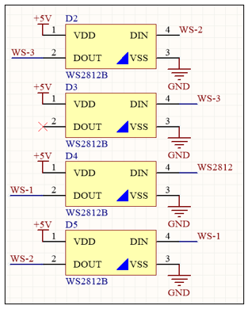
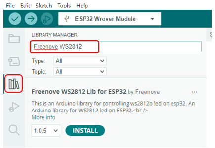
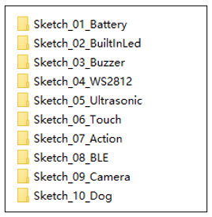
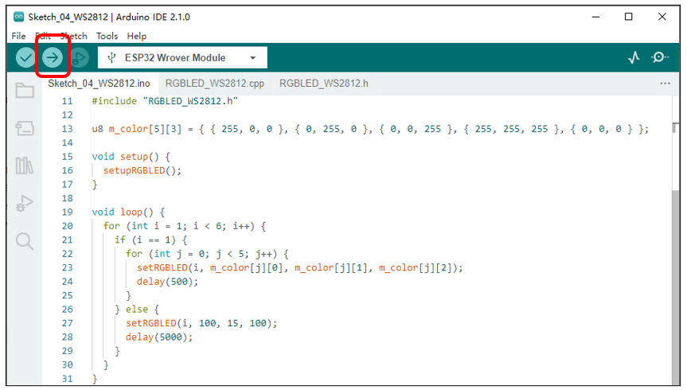

##############################################################################
Chapter 9 WS2812
##############################################################################

**If you have any concerns, please feel free to contact us via** support@freenove.com

Schematic
*************************************

As shown in the figure below, we connect the WS2812 to GPIO0 of ESP32. In this way, we can havel the WS2812 to display various colors by controlling GPIO0.

Sketch
*************************************

This code uses a library named "Freenove_WS2812_Lib_for_ESP32". If you have not installed it, please do so first.

How to install the library
=====================================

Click Library Manager on the left, enter “Freenove” in the search bar.

Open “Sketch_04_WS2812” folder in “Freenove_Robot_Dog_Kit_for_ESP32\\Sketches” and then double-click “Sketch_04_WS2812.ino”.

Sketch_04_WS2812
======================================

Upload the sketch to the esp32, the four WS2812 LEDs on the robot board will switch a colored light display mode every 5 seconds.

The following is the code:

.. literalinclude:: ../../../freenove_Kit/Sketches/Sketch_04_WS2812/Sketch_04_WS2812.ino
    :linenos:
    :language: c
    :dedent:

Initialize the WS2812 LED pins.

.. literalinclude:: ../../../freenove_Kit/Sketches/Sketch_04_WS2812/Sketch_04_WS2812.ino
    :linenos:
    :language: c
    :lines: 16-16
    :dedent:

When i=1, control the RGB LEDS to display the specified color. When i is not equal to 1, other patterns of colored lights are displayed.

.. literalinclude:: ../../../freenove_Kit/Sketches/Sketch_04_WS2812/Sketch_04_WS2812.ino
    :linenos:
    :language: c
    :lines: 23-23
    :dedent:

RGBLED_WS2812.h

.. literalinclude:: ../../../freenove_Kit/Sketches/Sketch_04_WS2812/RGBLED_WS2812.h
    :linenos:
    :language: c
    :dedent:

RGBLED_WS2812.cpp

.. literalinclude:: ../../../freenove_Kit/Sketches/Sketch_04_WS2812/RGBLED_WS2812.cpp
    :linenos:
    :language: c
    :dedent:

Apply for a colored light control object and configure this object.

.. literalinclude:: ../../../freenove_Kit/Sketches/Sketch_04_WS2812/RGBLED_WS2812.cpp
    :linenos:
    :language: c
    :lines: 14-14
    :dedent:

Initialize the RGB LEDs, and set their brightness to the maximum value. Start a thread and set task_RGBLeds() as the callback function of the thread.

.. literalinclude:: ../../../freenove_Kit/Sketches/Sketch_04_WS2812/RGBLED_WS2812.cpp
    :linenos:
    :language: c
    :lines: 30-34
    :dedent:

RGB LEDs configuration function. Call this function to set the colored light mode and the red, green, and blue color values of the LEDs.

.. literalinclude:: ../../../freenove_Kit/Sketches/Sketch_04_WS2812/RGBLED_WS2812.cpp
    :linenos:
    :language: c
    :lines: 36-41
    :dedent:

LED display function. The thread will control the RGB LEDs to emit different colors and phenomena according to the configuration information of ledConfig_t.

.. code-block:: c

    void task_showRGBLeds(void *pvParameters) {
    switch (ledConfig_t.mode) {
            case LED_MODE_OFF:
                ...
                break;
            case LED_MODE_RGB:
                ...
                break;
            case LED_MODE_FOLLOWING:
                ...
                break;
            case LED_MODE_BLINK:
                ...
                break;
            case LED_MODE_BREATHING:
                ...
                break;
            case LED_MODE_RAINBOW:
                ...
                break;
            default:
                break;
        }
    }

Thread callback function, when the thread starts, it will execute the color light display function cyclically.

.. literalinclude:: ../../../freenove_Kit/Sketches/Sketch_04_WS2812/RGBLED_WS2812.cpp
    :linenos:
    :language: c
    :lines: 132-136
    :dedent: