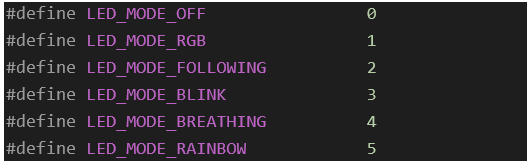

##############################################################################
Development
##############################################################################

Code Repository
*********************************

The main purpose of this tutorial is to explain how to assemble and use the robot dog. If you want to learn more about the code, please visit: 

https://github.com/Freenove/Freenove_ESP32_Dog_Firmware

There is a more detailed explanation of the code in the code repository, please download and learn by yourself.

Communication Command
*********************************

If you do not want to understand the underlying code of the robot dog, but want to develop a control platform software for the robot dog, you can refer to the following communication commands, which explain each control command of the robot dog in detail.

Ways of Communication
=========================================

The robot support three ways of communication, namely, serial port, Bluetooth Low Energy (BLE) and TCP Socket communication, as follows:

.. table:: 
    :class: zebra
    :align: center

    +-------------+------------------------------------------------------------------------+
    |    Ways     |                              Description                               |
    +=============+========================================================================+
    | Serial Port | Baud rate 115200                                                       |
    +-------------+------------------------------------------------------------------------+
    | BLE         | Bluetooth GATT                                                         |
    +-------------+------------------------------------------------------------------------+
    | TCP Socket  | Port 5000 is the command transmission port, and port 8000 is the video |
    |             |                                                                        |
    |             | transmission port.                                                     |
    +-------------+------------------------------------------------------------------------+

.. note::
    
    All commands are valid once they are sent. It is recommended not to send too many commands repeatedly in a short period as the processing capacity of the robot dog is limited. All commands only need to be sent once.

Communication Command Format
=========================================

1.	Each command consists of four parts: command word, delimiter, parameter and terminator, among which, the number of command word is one and the parameters is variable, from 0 to n, depending on the specific command.

A.	The first character of each command is the command word, used to distinguish the major category of the command, such as "A".  

B.	The character "#" is the delimiter between the command word and the parameter, used to separate the string.

C.	Each command is terminated with "\\n", which is used to separate each command.

Example: "A#10#20#30#40#50#\\n"

2.	Parse of Commands

When parsing commands, first separate the commands with "\\n", and then separate the command word and parameters of each command with"#". The characters after "\\n" are divided to the next command for parsing.

Command Words
========================================

We have defined the following 18 command words.

Explanation of Communication Protocol Instructions
**************************************************************************************

ACTION_UP_DOWN
====================================

Control the robot to stand up or lie down with one parameter. When lying down, the servos will be unloaded to reduce battery power consumption

.. table:: 
    :class: zebra
    :width: 70%
    :align: center

    +-------------+-------------------------------------------+
    | App command |                  Action                   |
    +=============+===========================================+
    | A#0#\\n     | Switch between standing up and lying down |
    +-------------+-------------------------------------------+
    | A#1#\\n     | Stand up                                  |
    +-------------+-------------------------------------------+
    | A#2#\\n     | Lie down                                  |
    +-------------+-------------------------------------------+

No return.

ACTION_BODY_HEIGHT
====================================

Set the robot dog's body to any height. This function has not been added to the app yet, but the robot dog can receive this command.

.. table:: 
    :class: zebra
    :width: 70%
    :align: center

    +----------+------------------------------------------------------+
    |   App    |                    command Action                    |
    +==========+======================================================+
    | B#50#\\n | Make the robot stand up and set the height to 50 cm. |
    +----------+------------------------------------------------------+

ACTION_RGB
==================================

Set the running mode and color of the LEDs on the robot dog.

.. table:: 
    :class: zebra
    :width: 70%
    :align: center

    +-----------------------------------------+-----------------------------------------------+
    | App command                             | Action                                        |
    +=========================================+===============================================+
    | C#mode#red#green#blue#\\n               | Set the RGB LEDs to "mode" mode and specify   |
    |                                         |                                               |
    |                                         | the color values of the three channels(0-255) |
    +-----------------------------------------+-----------------------------------------------+
    | C#1#255#0#0#\\n                         |                                               |
    +-----------------------------------------+-----------------------------------------------+
    | The value range and meaning of          | |Development01|                               |
    |                                         |                                               |
    | mode, among which, in modes 2 and       |                                               |
    |                                         |                                               |
    | 5, the color cannot be changed.         |                                               |
    |                                         |                                               |
    | The parameters can be any value in the  |                                               |
    |                                         |                                               |
    | range of 0-255.                         |                                               |
    +-----------------------------------------+-----------------------------------------------+

Introduction to "mode" function

.. table:: 
    :class: zebra
    :width: 70%
    :align: center

    +------------------------------+-----------+-----------------------------------------------+
    |       Macro Definition       | Parameter |                  Description                  |
    +==============================+===========+===============================================+
    | :purple:`LED_MODE_OFF`       | 0         | Turn OFF LEDs                                 |
    +------------------------------+-----------+-----------------------------------------------+
    | :purple:`LED_MODE_RGB`       | 1         | Static LEDs display. Color and brightness can |
    |                              |           |                                               |
    |                              |           | be adjusted through the parameters.           |
    +------------------------------+-----------+-----------------------------------------------+
    | :purple:`LED_MODE_FOLLOWING` | 2         | The LEDs alternately display four colors of   |
    |                              |           |                                               |
    |                              |           | red, green, yellow and blue.                  |
    +------------------------------+-----------+-----------------------------------------------+
    | :purple:`LED_MODE_BLINK`     | 3         | LEDs blink. Color and brightness can be       |
    |                              |           |                                               |
    |                              |           | adjusted through the parameters.              |
    +------------------------------+-----------+-----------------------------------------------+
    | :purple:`LED_MODE_BREATHING` | 4         | LEDs ON and OFF like breathing. Color and     |
    |                              |           |                                               |
    |                              |           | brightness can be adjusted through the        |
    |                              |           |                                               |
    |                              |           | parameters.                                   |
    +------------------------------+-----------+-----------------------------------------------+
    | :purple:`LED_MODE_RAINBOW`   | 5         | LEDs show the color of rainbow and change     |
    |                              |           |                                               |
    |                              |           | slowly.                                       |
    +------------------------------+-----------+-----------------------------------------------+

ACTION_BUZZER
================================

Set the frequency of the buzzer.

.. table:: 
    :class: zebra
    :width: 70%
    :align: center

    +-------------+------------------------------------------------+
    | App command |                     Action                     |
    +=============+================================================+
    | D#freq#\\n  | "freq" refers to the frequency of the buzzer.  |
    +-------------+------------------------------------------------+
    | D#2000#\\n  | Make the buzzer sound at the frequency of 2000 |
    +-------------+------------------------------------------------+
    | D#0#\\n     | Stop the buzzer.                               |
    +-------------+------------------------------------------------+

ACTION_TWIST
================================

Make the robot twist itself.

.. table:: 
    :class: zebra
    :width: 70%
    :align: center

    +----------------------+-----------------------------------------------------------+
    |     App command      |                          Action                           |
    +======================+===========================================================+
    | E#pitch#roll#yaw#\\n |                                                           |
    +----------------------+-----------------------------------------------------------+
    | E#20#0#0#\\n         | The robot is tilted by 20 degrees in the pitch direction. |
    +----------------------+-----------------------------------------------------------+
    | E#10#10#10#\\n       | The robot is tilted by 10 degrees in three directions.    |
    +----------------------+-----------------------------------------------------------+

Unit: degree, ranging from 0 to 20 degrees.

ACTION_MOVE_ANY
================================

F#alpha#stepLength#gama#spd#\\n

Make the robot move sideways for alpha degrees counterclockwise in its forward direction while rotating alpha degrees at each step, with the step length of stepLength and the speed of spd.

.. table:: 
    :class: zebra
    :width: 70%
    :align: center

    +-------------------+---------------------------------------------------------------------+
    | App command       | Action                                                              |
    +===================+=====================================================================+
    | F#0#20#0#5#\\n    | Moving forward at the speed of 5 and step length of 20mm.           |
    +-------------------+---------------------------------------------------------------------+
    | F#90#10#-10#5#\\n | The robot moves sideways to the left while rotating 10 degrees      |
    |                   |                                                                     |
    |                   | to the right at each step, with a step length of 10 and speed of 5. |
    +-------------------+---------------------------------------------------------------------+
    | F#0#0#0#5#\\n     | Stop moving                                                         |
    +-------------------+---------------------------------------------------------------------+

This command also only needs to be sent once. Once commanded, the robot keeps walking until it receives a new command, such as a command to stop walking or to twist its body.

ACTION_CAMERA
==============================

This is the command sent to the app to determine whether the camera is malfunctioned. The phone app receives and parses the command.

.. table:: 
    :class: zebra
    :width: 70%
    :align: center

    +---------------+---------------------------------------------------+
    | Robot command |                      Action                       |
    +===============+===================================================+
    | G#100#\\n     | The camera works fine, not need to process.       |
    +---------------+---------------------------------------------------+
    | G#101#\\n     | The camera is malfunctioned, prompting via Toast. |
    +---------------+---------------------------------------------------+

If the camera is faulty, the robot will periodically send reminders to the app, and the app will send a prompt to the user after receiving the message.

ACTION_ULTRASONIC
==========================================

Once the obstacle avoidance mode is turned ON, the robot will actively send the current distance measured by the ultrasonic wave to the app and the app needs to parse this command.

The App can also actively send this command for the robot dog to print out the distance measured by the ultrasonic wave through the serial port. Note that the command does not contain parameters, and there is currently no Action.

.. table:: 
    :class: zebra
    :width: 70%
    :align: center

    +-------------+-----------------------------------------------------------+
    | App command |                          Action                           |
    +=============+===========================================================+
    | H#\\n       | The robot obtains the distance measured by the ultrasonic |
    |             |                                                           |
    |             | module once, and prints it out through serial port.       |
    +-------------+-----------------------------------------------------------+

.. table:: 
    :class: zebra
    :width: 70%
    :align: center

    +---------------+-----------------------------------------------------------------+
    | Robot command |                             Action                              |
    +===============+=================================================================+
    | H#dist#\\n    | "dist" refers to the distance measured by the ultrasonic module |
    +---------------+-----------------------------------------------------------------+
    | H#101#\\n     | The current measured distance is 101 cm.                        |
    +---------------+-----------------------------------------------------------------+

ACTION_GET_VOLTAGE
=======================================

The robot actively sends the current voltage value and battery percentage to the app every 3 seconds without the need of the app to inquire.

The unit of voltage is mV.

.. table:: 
    :class: zebra
    :width: 70%
    :align: center

    +-----------------------+-----------------------------------------------------------+
    |     Robot command     |                          Action                           |
    +=======================+===========================================================+
    | I#voltage#percent#\\n | "voltage" refers to the current voltage of the batteries, |
    |                       |                                                           |
    |                       | and "percent" is the battery percentage.                  |
    +-----------------------+-----------------------------------------------------------+
    | I#8400#100%\\n        | The current voltage is 8400mV, 100%.                      |
    +-----------------------+-----------------------------------------------------------+

ACTION_CALIBRATE
======================================

Calibrate the robot. This command must contain only five parameters.

.. table:: 
    :class: zebra
    :width: 70%
    :align: center

    +----------------------+-----------------------------------------------------------------+
    |      Parameters      |                             Action                              |
    +======================+=================================================================+
    | J#legn#SSC#x#y#z#\n  |                                                                 |
    +----------------------+-----------------------------------------------------------------+
    | Legn                 | Leg number, numbered counterclockwise from left front to        |
    |                      |                                                                 |
    | right front, 0,1,2,3 |                                                                 |
    +----------------------+-----------------------------------------------------------------+
    | S: Select            | 1: Set the position of the legs without overlaying calibration  |
    |                      |                                                                 |
    |                      | information.                                                    |
    |                      |                                                                 |
    | S: Set               | 2: Confirm the calibration information.                         |
    |                      |                                                                 |
    | C: Confirm           | 3: Select one leg to calibrate.                                 |
    +----------------------+-----------------------------------------------------------------+
    | x, y, z              | They refer to the coordinates of the tiptoe of the robot dog,   |
    |                      |                                                                 |
    |                      | with the calibration point as the relative value of the origin. |
    |                      |                                                                 |
    |                      | If the leg does not need calibration, then it is 0 0 0.         |
    +----------------------+-----------------------------------------------------------------+

Examples:

.. table:: 
    :class: zebra
    :width: 70%
    :align: center

    +---------------------+----------------------------------------------------------------+
    |     App command     |                             Action                             |
    +=====================+================================================================+
    | J#2#3#0#0#0#\\n     | Leg 2 is selected to calibrate and the other legs are unloaded |
    |                     |                                                                |
    |                     | to prevent interference.                                       |
    +---------------------+----------------------------------------------------------------+
    | J#2#1#10#20#-10#\\n | Set leg 2 to the relative position of 10 20 -10                |
    +---------------------+----------------------------------------------------------------+
    | J#2#2#10#20#-10#\\n | Confirm and save the calibration information of 10 20 -20      |
    |                     |                                                                |
    |                     | to the robot.                                                  |
    +---------------------+----------------------------------------------------------------+

ACTION_SET_NVS
==============================

Save data. This command is a debug command without the need to be sent by the app.

.. table:: 
    :class: zebra
    :width: 70%
    :align: center

    +-------------+-------------------------------------+
    | App command |               Action                |
    +=============+=====================================+
    | K#1#\\n     | Save the mode and color of the LEDs |
    +-------------+-------------------------------------+
    | K#2#\\n     | Clear all data in NVS.              |
    +-------------+-------------------------------------+

ACTION_INSTALLATION
=============================

Put the robot into an installation or calibration pose.

.. table:: 
    :class: zebra
    :width: 70%
    :align: center

    +-------------+-------------------------------------------------+
    | App command |                     Action                      |
    +=============+=================================================+
    | L#1#\\n     | Put the robot in the installation pose          |
    |             |                                                 |
    |             | , and place all servos at 90 degrees            |
    +-------------+-------------------------------------------------+
    | L#2#\\n     | Put the robot in the calibration pose           |
    |             |                                                 |
    |             | without overlaying the calibration information. |
    +-------------+-------------------------------------------------+

ACTION_AUTO_WALKING
=============================

Put the robot into automatic obstacle avoidance mode. 

.. table:: 
    :class: zebra
    :width: 70%
    :align: center

    +-------------+-----------------------------------+
    | App command |              Action               |
    +=============+===================================+
    | M#0#\\n     | Turn OFF obstacle avoidance mode. |
    +-------------+-----------------------------------+
    | M#1#\\n     | Turn ON obstacle avoidance mode.  |
    +-------------+-----------------------------------+

ACTION_NETWORK
=============================

The robot's network related commands.

App sending

.. table:: 
    :class: zebra
    :width: 70%
    :align: center

    +------------------+-----------------------------------------------------------------------------------------+
    |   App command    |                                         Action                                          |
    +==================+=========================================================================================+
    | N#0#\\n          | The robot starts to scan WIFI and returns the results one by one in the following form: |
    |                  |                                                                                         |
    |                  | N#0#SSID#\\n                                                                            |
    +------------------+-----------------------------------------------------------------------------------------+
    | N#1#ssid#psd#\\n | The robot uses the password psd to connect to the WIFI hotspot                          |
    |                  |                                                                                         |
    |                  | named SSID and returns the result:                                                      |
    |                  |                                                                                         |
    |                  | Success: N#103#\\n                                                                      |
    |                  |                                                                                         |
    |                  | Failure: N#104#\\n                                                                      |
    |                  |                                                                                         |
    |                  | Later, regardless of success or failure, the WIFI status is sent again.                 |
    |                  |                                                                                         |
    |                  | (see the robot sending below)                                                           |
    +------------------+-----------------------------------------------------------------------------------------+
    | N#2#\\n          | Disconnect the robot's WIFI connection, and then send the WIFI status.                  |
    +------------------+-----------------------------------------------------------------------------------------+
    | N#3#\\n          | Establish a WIFI hotspot on the robot with the SSID as                                  |
    |                  |                                                                                         |
    |                  | "FreenoveDog-RobotId" and the password as 12345678.                                     |
    |                  |                                                                                         |
    |                  | Without this it will not success, The following results will be returned:               |
    |                  |                                                                                         |
    |                  | N#301#AP_SSID#IP#Password#\\n                                                           |
    |                  |                                                                                         |
    |                  | The above parameters are hotspot name, robot IP address                                 |
    |                  |                                                                                         |
    |                  | and hotspot password respectively.                                                      |
    +------------------+-----------------------------------------------------------------------------------------+
    | N#4#\\n          | Turn OFF the robot's hotspot.                                                           |
    +------------------+-----------------------------------------------------------------------------------------+
    | N#5#\\n          | Obtain the robot WIFI and camera status and return them once.                           |
    +------------------+-----------------------------------------------------------------------------------------+

Robot sending:

.. table:: 
    :class: zebra
    :width: 70%
    :align: center

    +------------------------------+----------------------------------------------------------------------+
    | Robot command                | Action                                                               |
    +==============================+======================================================================+
    | N#0#SSID#\\n                 | Return the robot's WIFI scanning results one by one.                 |
    +------------------------------+----------------------------------------------------------------------+
    | N#101#SSID#IP#\\n            | Robot's WIFI status: WIFI is connected. The parameters are the WIFI  |
    |                              |                                                                      |
    |                              | SSID and IP address of the robot in STA mode                         |
    +------------------------------+----------------------------------------------------------------------+
    | N#102#\\n                    | Robot's WIFI status: WIFI is not connected.                          |
    +------------------------------+----------------------------------------------------------------------+
    | N#103#\\n                    | The robot connects to WIFI successfully.                             |
    +------------------------------+----------------------------------------------------------------------+
    | N#104#\\n                    | The robot fails to connect to WIFI.                                  |
    +------------------------------+----------------------------------------------------------------------+
    | N#301#AP_SSID#IP#Password#\n | The robot's WIFI status: AP has been established. The parameters are |
    |                              |                                                                      |
    |                              | the robot's WIFI SSID, IP address and password in AP mode.           |
    +------------------------------+----------------------------------------------------------------------+
    | N#302#\\n                    | The robot's WIFI hotspot has been turned OFF.                        |
    +------------------------------+----------------------------------------------------------------------+
    | N#5#\\n                      | Obtain the robot WIFI and camera status and return them once.        |
    +------------------------------+----------------------------------------------------------------------+

ACTION_DANCING
=============================

Make the robot dance at some fixed actions.

.. table:: 
    :class: zebra
    :width: 70%
    :align: center

    +-------------+-------------------------------------+
    | App command |               Action                |
    +=============+=====================================+
    | O#n#\\n     | n refers to the fixed action modes. |
    +-------------+-------------------------------------+
    | O#0#\\n     | Say hello                           |
    +-------------+-------------------------------------+
    | O#1#\\n     | Push up                             |
    +-------------+-------------------------------------+
    | O#2#\\n     | Stretch itself                      |
    +-------------+-------------------------------------+
    | O#3#\\n     | Turn around                         |
    +-------------+-------------------------------------+
    | O#4#\\n     | Sit down                            |
    +-------------+-------------------------------------+
    | O#5#\\n     | Dance                               |
    +-------------+-------------------------------------+

The value and meanings of parameter n are as follows

ACTION_SET_ROBOT
=============================

Reserved.

ACTION_TEST
=============================

Reserved. Develop to use.

ID_CHECK
=============================

Check the basic information of the robot, which is used for verification in the future. 

.. table:: 
    :class: zebra
    :width: 70%
    :align: center

    +------------------+---------------------------------------------------------------------------------+
    |   App command    |                                     Action                                      |
    +==================+=================================================================================+
    | W#0#\\n          | Obtain the firmware version and robot name. The result returned are as follows: |
    |                  |                                                                                 |
    |                  | W#0#100#FREENOVE-DOG#\\n                                                        |
    |                  |                                                                                 |
    |                  | among which,                                                                    |
    |                  |                                                                                 |
    |                  | 100 refers to the version of V1.0.0 and the name of FREENOVE-DOG.               |
    +------------------+---------------------------------------------------------------------------------+
    | W#1#\\n          | Obtain the robot's firmware version with the result returned as follows:        |
    |                  |                                                                                 |
    |                  | W#1#100#\\n                                                                     |
    |                  |                                                                                 |
    |                  | among which,                                                                    |
    |                  |                                                                                 |
    |                  | 100 refers to the version of V1.0.0                                             |
    +------------------+---------------------------------------------------------------------------------+
    | W#2#\\n          | Obtain the robot's name with the result returned as follows:                    |
    |                  |                                                                                 |
    |                  | W#2#FREENOVE-DOG#\\n                                                            |
    |                  |                                                                                 |
    |                  | referring to the name as FREENOVE-DOG                                           |
    +------------------+---------------------------------------------------------------------------------+
    | W#3#\\n          | Obtain the internal code with the current result returned as follows            |
    |                  |                                                                                 |
    |                  | W#3#FNK006201#\\n                                                               |
    +------------------+---------------------------------------------------------------------------------+
    | W#4#FREENOVE#\\n | Fixed command to check whether the source of the controller is valid.           |
    +------------------+---------------------------------------------------------------------------------+