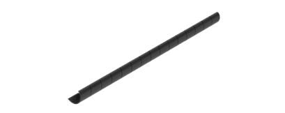
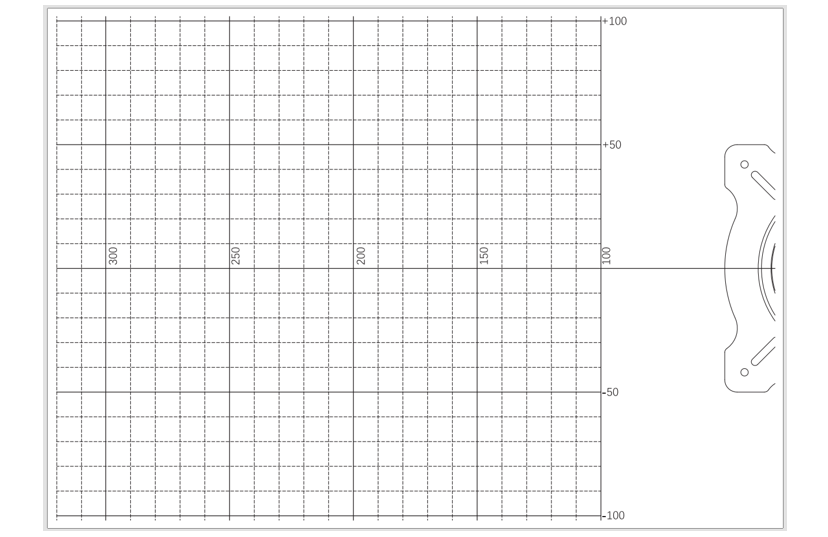
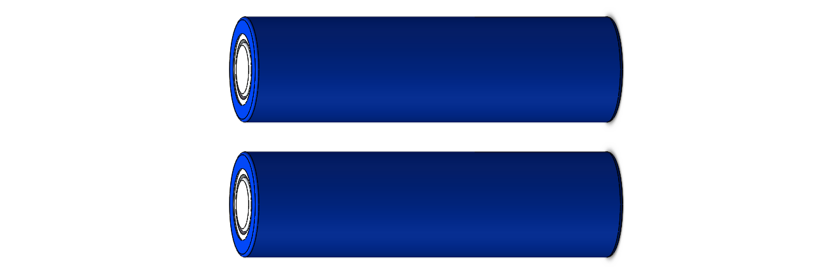

##############################################################################
List
##############################################################################

If you have any concerns, please feel free to contact us at support@freenove.com

Robot Expansion Board for ESP32
**********************************************

.. list-table:: 
    :align: center

    * - Top
    * - |List00|

    * - Bottom
    * - |List01|

ESP32
**********************************************

.. list-table:: 
    :align: center

    * - ESP32
      - OV2640

    * - |List02|
      - |List03|

Machinery
**********************************************

Transmission
**********************************************

.. list-table:: 
    :align: center

    * - Servo package x12
    * - |List05|

Acrylic
***********************************************

.. list-table:: 
    :align: center

    * - Acrylic x1
    * - |List06|

Electronic
***********************************************

.. list-table:: 
    :align: center

    * - Extension board for camera
      - HC-SR04 ultrasonic module
      - Touch module 

    * - |List07|
      - |List08|
      - |List09|

Tools
***********************************************

+---------------------------+-----------------+
|Cross screwdriver (3mm) x1 |                 |
|                           |Cable tidy x80cm |
|Cross screwdriver (2mm) x1 |                 |
|                           ||List11|         |
||List10|                   |                 |
|                           |                 |
+---------------------------+-----------------+
|Pry bar                    |USB cable        |
|                           |                 |
||List12|                   ||List13|         |
|                           |                 |
+---------------------------+-----------------+
|FPC camera cable                             |
|                                             |
||List14|                                     |
|                                             |
+---------------------------+-----------------+
|3P LED cable               |4P jumper wire   |
|                           |                 |
||List15|                   ||List16|         |
|                           |                 |
+---------------------------+-----------------+

Calibration
****************************************************

.. list-table:: 
    :align: center

    * - Calibration graph
    * - |List17|

Required but NOT Included Parts
*****************************************************

.. list-table:: 
    :align: center

    * - 2 X 18650 flat top batteries with :blue:`continuous discharge current ≥ 10A`
        
        It is not easy to find proper batteries on Amazon. 
        
        Search :blue:`18650 3.7V high drain on eBay` or other websites.

    * - |List18|

