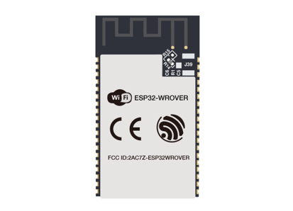
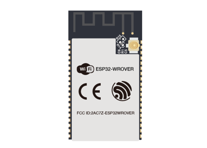
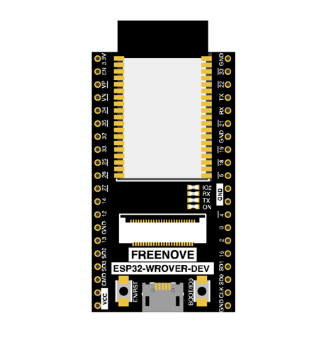
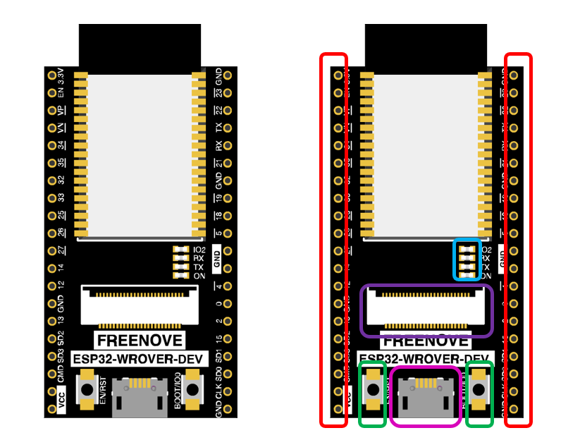
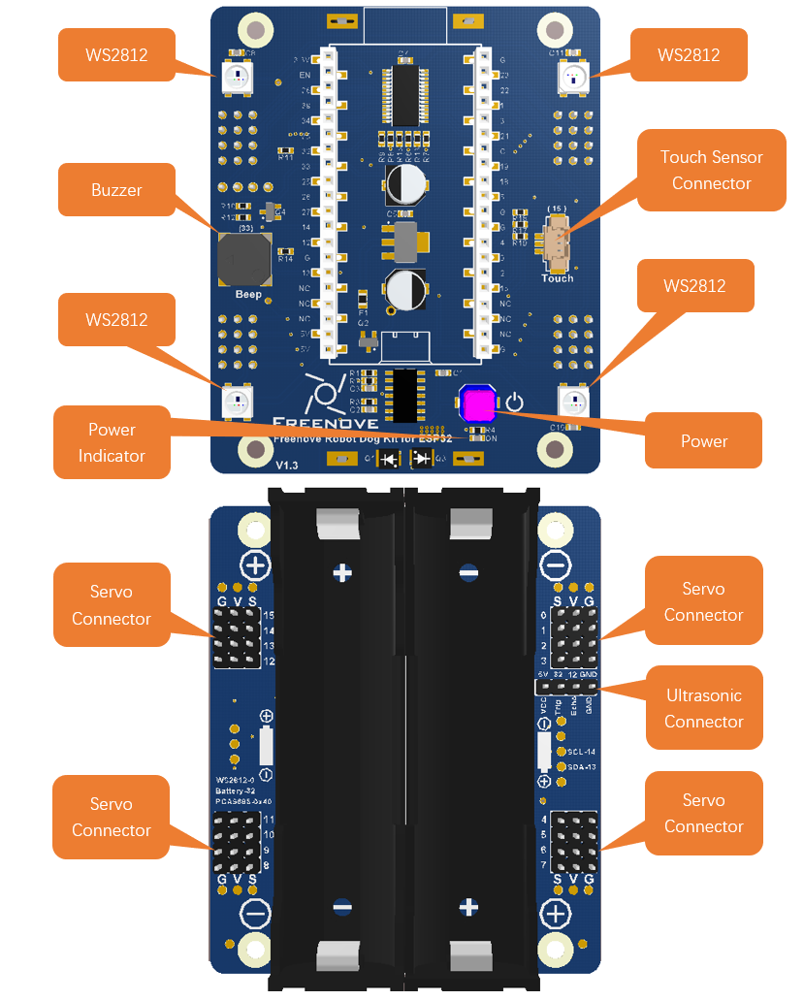

##############################################################################
Preface
##############################################################################

Welcome to use Freenove Robot Dog Kit for ESP32. Following this tutorial, you can make a very cool robot dog with many functions.

This kit is based on ESP32, a popular control panel, so you can exchange your experience and design ideas with many enthusiasts all over the world. The parts in this kit include all electronic components, modules, and mechanical components required for making the robot dog. And all of them are packaged individually. There are detailed assembly and commissioning instructions in this book. 

If you encounter any problems, please feel free to contact us for quick and free technical support.

support@freenove.com 

This book aims to help enthusiasts assemble the robot dog and download related codes. You can read and download the codes via the link below:

https://github.com/Freenove/Freenove_ESP32_Dog_Firmware

You can refer to another esp32 kit designed for starters: :red:`Freenove_Ultimate_Starter_Kit_for_ESP32.`

https://www.freenove.com/store.html

ESP32
*************************************

ESP32-Wrover comes with two different antenna packages, PCB (on-board) antenna and IPEX™ antenna. The PCB on-board antenna is an integrated antenna in the chip module itself, so it is convenient to carry and design. The IPEX™ antenna is a metal antenna connector, derived from the integrated antenna of the chip module itself, which is used to enhance the signal of the ESP32 module.

.. list-table:: 
    :align: center

    * - PCB on-board antenna 
      - IPEX antenna 

    * - |Preface00|
      - |Preface01|

In this tutorial, the ESP32-WROVER is designed based on PCB on-board antenna packaged ESP32-WROVER module.

Pins Used for the Robot
*********************************

To learn what each GPIO corresponds to, please refer to the following table.

The functions of the pins are allocated as follows:

+--------------+-----------------------------------------+------------+
|Pins of ESP32 |Functions                                |Description |
|              |                                         |            |
+--------------+-----------------------------------------+------------+
|GPIO36        |                                         |CSI_Y6      |
|              |                                         |            |
+--------------+                                         +------------+
|GPIO39        |                                         |CSI_Y7      |
|              |                                         |            |
+--------------+                                         +------------+
|GPIO34        |                                         |CSI_Y8      |
|              |                                         |            |
+--------------+                                         +------------+
|GPIO35        |                                         |CSI_Y9      |
|              |                                         |            |
+--------------+                                         +------------+
|GPIO25        |                                         |CSI_VYSNC   |
|              |                                         |            |
+--------------+                                         +------------+
|GPIO26        |                                         |SIOD        |
|              |                                         |            |
+--------------+                                         +------------+
|GPIO27        |                                         |SIOC        |
|              |                                         |            |
+--------------+Camera interface                         +------------+
|GPIO4         |                                         |CSI_Y2      |
|              |                                         |            |
+--------------+                                         +------------+
|GPIO5         |                                         |CSI_Y3      |
|              |                                         |            |
+--------------+                                         +------------+
|GPIO18        |                                         |CSI_Y4      |
|              |                                         |            |
+--------------+                                         +------------+
|GPIO19        |                                         |CSI_Y5      |
|              |                                         |            |
+--------------+                                         +------------+
|GPIO21        |                                         |XCLK        |
|              |                                         |            |
+--------------+                                         +------------+
|GPIO22        |                                         |PCLK        |
|              |                                         |            |
+--------------+                                         +------------+
|GPIO23        |                                         |HREF        |
|              |                                         |            |
+--------------+-----------------------------------------+------------+
|GPIO13        |                                         |SDA         |
|              |                                         |            |
+--------------+I2C port                                 +------------+
|GPIO14        |                                         |SCL         |
|              |                                         |            |
+--------------+-----------------------------------------+------------+
|GPIO32        |Battery detection / Ultrasonic-Trig port |A6 / Trig   |
|              |                                         |            |
+--------------+-----------------------------------------+------------+
|GPIO12        |Ultrasonic-Echo port                     |Echo        |
|              |                                         |            |
+--------------+-----------------------------------------+------------+
|GPIO33        |Buzzer port                              |Buzzer      |
|              |                                         |            |
+--------------+-----------------------------------------+------------+
|GPIO15        |Touch Sensor port                        |Touch       |
|              |                                         |            |
+--------------+-----------------------------------------+------------+
|GPIO0         |WS2812 port                              |WS2812      |
|              |                                         |            |
+--------------+-----------------------------------------+------------+
|GPIO1         |                                         |TX          |
|              |                                         |            |
+--------------+Serial port                              +------------+
|GPIO3         |                                         |RX          |
|              |                                         |            |
+--------------+-----------------------------------------+------------+

The hardware interfaces of ESP32 are distributed as follows:

Compare the left and right images. We have boxed off the resources on the ESP32 in different colors to facilitate its understanding.

.. list-table:: 
    :align: center

    * - Box color
      - Corresponding resources introduction

    * - |Preface04|
      - GPIO pin

    * - |Preface05|
      - LED indicator

    * - |Preface06|
      - Camera interface

    * - |Preface07|
      - Reset button, Boot mode selection button 

    * - |Preface08|
      - USB port

Robot Expansion Board for ESP32

The functions of the board are as follows:

Note: Please refer to the marks on the battery holder to install batteries; otherwise, the circuit will not work.